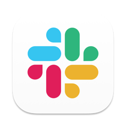
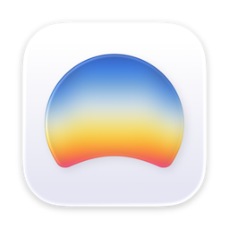
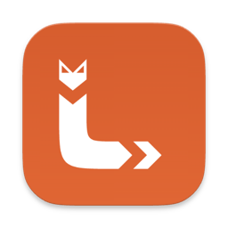

# 🍎 co-mac

> 새로 받은 맥북 한 대를 명령어 한 줄로 co:code 팀 전체와 똑같은 개발환경으로 만들어주는 스크립트입니다.

[](https://www.apple.com/macos/)
[](./mac-setup.sh)
[](https://brew.sh)

이 저장소에는 딱 두 개의 파일만 있습니다.

- [`mac-setup.sh`](./mac-setup.sh) — 개발환경을 자동으로 설치해주는 스크립트
- `README.md` — 지금 보고 계신 이 문서

## 목차

- [🙋 이런 분들을 위한 레포입니다](#who-is-this-for)
- [🚀 빠른 시작](#quickstart)
- [🧰 우리 팀의 기술 스택](#tech-stack)
- [📦 무엇이 설치되나요](#whats-installed)
- [✅ 설치 후 확인할 것](#after-install)
- [🔒 안전한가요](#is-it-safe)
- [🐛 문제가 생겼나요](#troubleshooting)
- [💬 도움이 필요하신가요](#get-help)

<br>

<a id="who-is-this-for"></a>

## 🙋 이런 분들을 위한 레포입니다

co:code는 엔지니어뿐 아니라 디자이너, PM도 하나의 엔지니어링 조직 아래에서 함께 일합니다. 그래서 **직군과 상관없이, 새로 합류한 모든 팀원이 이 스크립트 하나로 노트북을 세팅**합니다.

"나는 개발자가 아닌데 왜 개발환경 스크립트를 실행하지?" 라는 생각이 드신다면, 이렇게 이해해주시면 됩니다.

- 이 스크립트는 사실 여러 개의 앱과 도구를 하나씩 손으로 내려받아 설치하는 번거로운 과정을, 터미널(글자로 명령을 내리는 화면)에서 대신 자동으로 처리해주는 프로그램일 뿐입니다.
- Slack, Figma, Chrome처럼 직군에 관계없이 매일 쓰는 앱들도 이 스크립트가 함께 설치해 드립니다.
- 팀 전체의 노트북 환경이 같으면, 누가 무엇을 도와줄 때 "제 컴퓨터에서는 되는데요?" 같은 상황 없이 서로 빠르게 도와줄 수 있습니다.
- 프로그래밍을 잘 모르셔도 괜찮습니다. 아래 [빠른 시작](#quickstart)만 따라 하시면 됩니다. 실행 중에는 지금 무엇을 하고 있는지 화면에 계속 안내 문구가 표시됩니다.
- 스크립트 코드는 이 저장소의 [`mac-setup.sh`](./mac-setup.sh) 하나뿐이고, 전체가 공개되어 있어 누구나 열어서 무슨 일을 하는지 읽어볼 수 있습니다.

<br>

<a id="quickstart"></a>

## 🚀 빠른 시작

### 준비물

- macOS가 설치된 맥북
- Homebrew 설치 완료 — 없다면 [brew.sh](https://brew.sh) 안내를 따라 먼저 설치해주세요
- Xcode 설치 완료 (App Store에서 설치) — Command Line Tools만 설치돼 있어 `xcode-select`가 그쪽을 가리키는 상태여도 괜찮습니다. 스크립트가 실행 중 자동으로 Xcode.app으로 전환해 드립니다(아래 [무엇이 설치되나요](#whats-installed) 참고)

> 💡 **Homebrew가 뭔가요?** macOS에서 개발 도구들을 설치·관리해주는 프로그램입니다. 이 스크립트가 설치하는 대부분의 도구는 Homebrew를 통해 내려받아집니다. `mac-setup.sh`는 Homebrew가 없으면 바로 종료되고 안내 메시지를 보여주니, 먼저 설치해주세요.

### 실행

```bash
git clone https://github.com/coco-de/co-mac.git
cd co-mac
chmod +x mac-setup.sh && ./mac-setup.sh
```

이게 전부입니다. 이후로는 화면에 뜨는 진행 상황(`▶ 단계 이름`)을 지켜보시면 됩니다. 도구별로 이미 설치되어 있으면 `✓`, 새로 설치하면 진행 로그, 일부가 실패해도 `⚠` 표시와 함께 건너뛰고 계속 진행됩니다. 실행 초반에 **커밋에 사용할 회사 이메일**을 한 번 물어보니 입력해주세요 (이미 설정된 맥이라면 묻지 않습니다).

> 💡 **이미 세팅한 맥에서 토큰(환경변수)만 다시 받고 싶다면**
>
> ```bash
> ./mac-setup.sh --env-only
> ```
>
> 앱·도구 설치는 전부 건너뛰고, 1Password(`op`)에서 팀 공용 토큰(`ZENHUB_API_TOKEN`·`JIRA_API_TOKEN`·`SLANG_GPT_API_KEY`·`DCM_EMAIL`·`DCM_CI_KEY`·`SLACK_TEAM_ID`·`SLACK_BOT_TOKEN`)만 다시 읽어 `~/.zshrc`에 넣어줍니다. 토큰이 바뀌었거나 설치 때 토큰 주입(8.5~8.9단계)을 건너뛴 경우, 전체 설치를 다시 돌릴 필요 없이 몇 초 만에 끝납니다. 사용법은 `./mac-setup.sh --help`로도 볼 수 있습니다.

<details>
<summary>예전에 쓰던 맥이 있다면 (선택 사항)</summary>

<br>

예전 맥의 터미널 테마·설정을 그대로 옮겨오고 싶다면, 그 맥에서 `~/.zshrc`, `~/.p10k.zsh` 두 파일을 **이 스크립트와 같은 폴더**에 복사해 둔 뒤 실행하세요. 스크립트가 이 파일들을 감지하면 그대로 복사해서 씁니다.

이 두 파일은 저장소에 들어있지 않습니다. 각자의 개인 설정 파일이라 필요한 분만 직접 준비하시면 됩니다. 파일이 없으면 스크립트가 기본 설정을 새로 만들어 줍니다.

⚠️ 예전 `.zshrc`를 가져오실 경우 [보안 안내](#is-it-safe)를 꼭 확인해주세요.

</details>

<br>

<a id="tech-stack"></a>

## 🧰 우리 팀의 기술 스택

`mac-setup.sh` 하나로 co:code 팀 전체 노트북에 실제로 세팅되는 앱·CLI·언어 런타임을 한눈에 모았습니다. 아이콘은 대부분 [Simple Icons](https://simpleicons.org)에서 받아 이 저장소의 [`assets/icons/`](./assets/icons)에 함께 보관하고 있습니다. Simple Icons에 없는 앱(Slack·Dia·Orca·Lumide)은 실제 설치되는 앱의 아이콘을 그대로 추출해 사용했습니다. 공식 브랜드 아이콘이 아직 없는 도구는 이름만 표기했습니다.

<br>

**🖥 GUI 앱**

<table>
<tr>
<td align="center" width="100"><br><sub><b>Android Studio</b></sub></td>
<td align="center" width="100"><br><sub><b>Slack</b></sub></td>
<td align="center" width="100"><br><sub><b>Figma</b></sub></td>
<td align="center" width="100"><br><sub><b>Claude Desktop</b></sub></td>
<td align="center" width="100"><br><sub><b>Google Chrome</b></sub></td>
</tr>
<tr>
<td align="center" width="100"><br><sub><b>1Password</b></sub></td>
<td align="center" width="100"><br><sub><b>Dia</b></sub></td>
<td align="center" width="100"><br><sub><b>Tailscale</b></sub></td>
<td align="center" width="100"><br><sub><b>Orca</b></sub></td>
<td align="center" width="100"><br><sub><b>Lumide</b></sub></td>
</tr>
<tr>
<td align="center" width="100"><br><sub><b>Zed</b></sub></td>
<td align="center" width="100"><br><sub><b>Rive</b></sub></td>
<td align="center" width="100"></td>
<td align="center" width="100"></td>
<td align="center" width="100"></td>
</tr>
</table>

**🛠 CLI 도구**

<table>
<tr>
<td align="center" width="100"><br><sub><b>go</b></sub></td>
<td align="center" width="100"><sub><b>pyenv</b></sub></td>
<td align="center" width="100"><br><sub><b>nvm</b></sub></td>
<td align="center" width="100"><br><sub><b>git</b></sub></td>
<td align="center" width="100"><br><sub><b>gh</b></sub></td>
<td align="center" width="100"><br><sub><b>cocoapods</b></sub></td>
</tr>
<tr>
<td align="center" width="100"><br><sub><b>fastlane</b></sub></td>
<td align="center" width="100"><sub><b>awscli</b></sub></td>
<td align="center" width="100"><sub><b>colima</b></sub></td>
<td align="center" width="100"><br><sub><b>docker</b></sub></td>
<td align="center" width="100"><br><sub><b>docker-compose</b></sub></td>
<td align="center" width="100"><sub><b>direnv</b></sub></td>
</tr>
<tr>
<td align="center" width="100"><br><sub><b>zsh-syntax-<br>highlighting</b></sub></td>
<td align="center" width="100"><br><sub><b>openjdk@17</b></sub></td>
<td align="center" width="100"><br><sub><b>Claude Code</b></sub></td>
<td align="center" width="100"><br><sub><b>op</b><br>(1Password CLI)</sub></td>
<td align="center" width="100"><br><sub><b>codex</b><br>(OpenAI)</sub></td>
<td align="center" width="100"><br><sub><b>agy</b><br>(Antigravity)</sub></td>
</tr>
<tr>
<td align="center" width="100"><br><sub><b>ccstatusline</b><br>(상태줄)</sub></td>
<td align="center" width="100"><br><sub><b>awesome-<br>statusline</b><br>(상태줄 대체)</sub></td>
<td align="center" width="100"><br><sub><b>mas</b><br>(App Store CLI)</sub></td>
<td align="center" width="100"><br><sub><b>slack</b><br>(Slack CLI)</sub></td>
<td align="center" width="100"></td>
<td align="center" width="100"></td>
</tr>
</table>

**🐦 Flutter / Dart**

<table>
<tr>
<td align="center" width="100"><br><sub><b>fvm</b></sub></td>
<td align="center" width="100"><br><sub><b>DCM</b></sub></td>
<td align="center" width="100"><br><sub><b>serverpod_cli</b></sub></td>
<td align="center" width="100"><br><sub><b>marionette_mcp</b></sub></td>
</tr>
</table>

**☁️ 클라우드 / 🐍 언어 런타임**

<table>
<tr>
<td align="center" width="100"><br><sub><b>gcloud</b></sub></td>
<td align="center" width="100"><br><sub><b>Python</b></sub></td>
<td align="center" width="100"><br><sub><b>Node.js</b></sub></td>
<td align="center" width="100"><br><sub><b>npm</b></sub></td>
</tr>
</table>

**💻 터미널 환경**

<table>
<tr>
<td align="center" width="100"><sub><b>oh-my-zsh</b></sub></td>
<td align="center" width="100"><sub><b>powerlevel10k</b></sub></td>
<td align="center" width="100"><br><sub><b>zsh-auto-<br>suggestions</b></sub></td>
<td align="center" width="100"><sub><b>MesloLGS NF</b><br>(폰트)</sub></td>
</tr>
</table>

<br>

<sub>※ Slack · Dia · Orca · Lumide · codex(OpenAI) · agy(Antigravity)는 Simple Icons에 없어, 실제 브랜드 아이콘(파비콘)을 받아 사용했습니다. awscli, pyenv, colima, direnv, oh-my-zsh, powerlevel10k, MesloLGS NF는 공식 브랜드 아이콘이 없어 텍스트로만 표기했습니다. DCM · serverpod_cli · marionette_mcp는 Dart 생태계 도구라 Dart 아이콘으로 대신 표기했습니다. op(1Password CLI)는 1Password의 커맨드라인 버전이라 1Password 아이콘을 함께 사용했습니다. ccstatusline · awesome-statusline은 둘 다 Claude Code 상태줄 도구라 Claude 아이콘으로 대신 표기했습니다.</sub>

<br>

<a id="whats-installed"></a>

## 📦 무엇이 설치되나요

| 분류 | 항목 |
|---|---|
| 🖥 GUI 앱 | Android Studio, Slack, Figma, Claude Desktop, Google Chrome, Dia, 1Password, Tailscale, Orca, Lumide, Zed, Rive |
| 🍎 Xcode 개발자 도구 | Xcode.app이 없으면 `mas`(App Store CLI)로 자동 설치 시도(App Store 로그인 필요 · 수십 GB라 오래 걸릴 수 있음). Command Line Tools만 활성화돼 있으면(`xcodebuild` "requires Xcode" 에러 원인) `xcode-select`를 Xcode.app으로 자동 전환하고 최초 실행 동의(`xcodebuild -runFirstLaunch`)까지 진행 (sudo 암호 입력 필요) |
| 🧩 브라우저 확장 프로그램 | Chrome·Dia에 [ZenHub for GitHub](https://chromewebstore.google.com/detail/zenhub-for-github/ogcgkffhplmphkaahpmffcafajaocjbd) 확장을 자동 등록(External Extensions 드롭인 방식, sudo 암호 입력 필요) — Dia는 동작이 보장되지 않아 실패해도 경고만 남기고 계속 진행 |
| 🔌 Claude MCP | figma·flutter-mcp-toolkit 플러그인 자동 설치 + maestro CLI, flutter-mcp-toolkit CLI, marionette·dart MCP, zenhub·jira·slack MCP 자동 등록. `ZENHUB_API_TOKEN`·`JIRA_API_TOKEN`·`SLACK_TEAM_ID`·`SLACK_BOT_TOKEN`(팀 공용 토큰)은 1Password CLI(`op`)로 `~/.zshrc`에 자동 주입 — git에 커밋 안 됨 (⚠️ figma는 최초 1회 `/mcp` OAuth 로그인. zenhub·jira·slack은 OAuth 대신 1Password 팀 공용 토큰으로 인증 — 1Password 앱의 CLI 통합만 되면 자동 주입. jira는 `sooperset/mcp-atlassian`(Docker)로 **Jira REST API에 직접** 붙어(개발팀 공용 계정 토큰) 조직 Rovo 권한이 필요 없음 — 런타임에 colima/docker 데몬 필요. slack은 `@modelcontextprotocol/server-slack`(npx)로 뜨며 팀 ID+봇 토큰 두 값이 모두 있어야 인증됨 — [설정 방법](#after-install). flutter-mcp-toolkit은 인증 불필요하나, 특정 Flutter 프로젝트에서 쓰려면 해당 프로젝트에서 `flutter-mcp-toolkit codegen-init` 1회 실행 필요) |
| 🔑 팀 공용 토큰 | 위 `ZENHUB_API_TOKEN`·`JIRA_API_TOKEN`·`SLACK_TEAM_ID`·`SLACK_BOT_TOKEN`에 더해, 다국어 자동 번역 도구 `slang_gpt`가 쓰는 `SLANG_GPT_API_KEY`, DCM을 CI 모드로 인증하는 `DCM_EMAIL`·`DCM_CI_KEY`(1Password 항목 `DCM CI CD`의 이메일+키 한 쌍)도 같은 방식(1Password CLI → `~/.zshrc`)으로 자동 주입 — `SLANG_GPT_API_KEY`·`DCM_EMAIL`·`DCM_CI_KEY`는 MCP가 아니라 명령줄 도구가 직접 읽는 값이라 등록·로그인 과정이 없음 ([설정 방법](#after-install)) |
| 🧩 cocode-skills 팀 플러그인 | 사설 레포 `coco-de/skills`의 `install.sh`로 cc-* 플러그인 번들(marionette·dart·figma·dev-cycle·coui 등) 자동 동기화 (⚠️ `gh auth login` 인증 필요, 미인증 시 건너뜀) |
| 📱 Android SDK | cmdline-tools, platform-tools, build-tools, platforms, NDK, 에뮬레이터 시스템 이미지, AVD까지 전부 자동 설치·구성 (Android Studio 첫 실행 마법사 불필요) |
| 🛠 CLI 도구 | go, pyenv, nvm, git, gh, cocoapods, fastlane, awscli, colima, docker, docker-compose, zsh-syntax-highlighting, direnv, openjdk@17, Claude Code, ccstatusline(Claude Code 상태줄) → 실패 시 awesome-statusline(size: small)으로 자동 대체, codex, agy(Antigravity CLI), slack(Slack CLI), op(1Password CLI), mas(App Store CLI — Xcode 자동 설치용) |
| ✉️ Git 설정 | 커밋에 사용할 회사 이메일을 실행 중에 입력받아 전역 설정(`git config --global user.email`) — 이미 설정돼 있으면 묻지 않고 건너뜀 |
| 🌐 브라우저 번역 언어 | Chrome·Dia의 번역 대상 언어를 한국어로, "번역 안 함" 목록을 영어로 자동 설정(`dia://settings/languages` = `chrome://settings/languages`를 매번 손으로 누를 필요 없음) — 브라우저가 실행 중이면 건너뛰고 경고만 표시 |
| 🐦 Flutter | fvm(버전 관리자)으로 Flutter stable 채널 글로벌 설정, DCM(Dart 코드 품질 검사 도구 — CI 인증 키 `DCM_EMAIL`·`DCM_CI_KEY`는 1Password에서 자동 주입) |
| 🎯 Dart 글로벌 패키지 | serverpod_cli 4.0.0-beta.0, marionette_mcp |
| ☁️ 클라우드 | Google Cloud CLI (gcloud) |
| 🐍 언어 런타임 | Python 최신 3.x (pyenv), Node.js LTS + npm (nvm) |
| 💻 터미널 환경 | oh-my-zsh, powerlevel10k 테마, zsh-autosuggestions, zsh-syntax-highlighting, MesloLGS NF 폰트 |

모든 항목은 이미 설치되어 있으면 건너뛰도록 되어 있어, 스크립트를 여러 번 실행해도 안전합니다.

<details>
<summary>도구별 상세 설명 펼쳐보기 (하나하나 뭔지 궁금하신 분만)</summary>

<br>

**GUI 앱 (Homebrew Cask)**

| | 도구 | 용도 |
|---|---|---|
|  | Android Studio | 안드로이드 앱 개발 IDE (Flutter 개발에도 사용) |
|  | Slack | 팀 커뮤니케이션 |
|  | Figma | 디자인 툴 |
|  | Claude Desktop | Claude AI 어시스턴트 데스크톱 앱 |
|  | Google Chrome | 웹 브라우저 |
|  | Dia | AI 기반 웹 브라우저 |
|  | 1Password | 비밀번호 관리자 |
|  | Tailscale | 팀 내부망 접속용 VPN 메시 네트워크 (메뉴바 앱 + CLI) |
|  | Orca | AI 코딩 에이전트 도구 (stablyai/orca 탭) |
|  | Lumide | 에이전트 네이티브 코드 에디터 IDE ([lumide.dev](https://lumide.dev)) |
|  | Zed | 협업 기능이 내장된 코드 에디터 ([zed.dev](https://zed.dev)) |
|  | Rive | 인터랙티브 애니메이션·모션 그래픽 디자인 툴 ([rive.app](https://rive.app)) |

이미 `/Applications`에 앱이 설치되어 있으면 건너뜁니다.

**브라우저 확장 프로그램 자동 등록**

Chrome·Dia 설치 직후, [ZenHub for GitHub](https://chromewebstore.google.com/detail/zenhub-for-github/ogcgkffhplmphkaahpmffcafajaocjbd) 확장을 구글이 공식 문서화한 "External Extensions" 드롭인 방식(`/Library/Application Support/<브라우저>/External Extensions/<확장ID>.json`)으로 자동 등록합니다. 다음에 해당 브라우저를 실행하면 스토어에서 자동으로 받아 설치됩니다. 시스템 폴더에 파일을 심어야 해서 **sudo 암호 입력이 필요**하며(터미널 대화형 실행일 때만 시도), Preferences 파일을 직접 고치는 방식은 브라우저의 변조 감지로 되돌아가기 때문에 이 공식 경로만 사용합니다. Dia는 Chrome과 같은 크로미움 기반이라 동일한 방식을 시도하지만, Arc 계열 제품 특성상 엔터프라이즈 정책 훅이 막혀 있을 수 있어 실제 설치까지 이어진다는 보장은 없습니다 — 적용되지 않아도 오류로 취급하지 않고 조용히 넘어가며, 안 될 경우 위 링크에서 수동으로 추가하면 됩니다.

**Android SDK (자동 설치·구성)**

Android Studio 앱만 설치하면 SDK는 비어 있어서, 원래는 앱을 한 번 실행해 설치 마법사를 직접 눌러가며 구성 요소를 받아야 합니다. 이 스크립트는 `android-commandlinetools`(Homebrew)로 받은 `sdkmanager`/`avdmanager`를 이용해 아래 항목을 전부 커맨드라인에서 자동으로 설치·구성하므로, 그 과정이 필요 없습니다.

| 도구 | 용도 |
|---|---|
| cmdline-tools | Android SDK를 터미널에서 다루는 도구 모음 (`sdkmanager`, `avdmanager`). Homebrew 버전은 부트스트랩으로만 쓰고, 최신 버전을 표준 위치(`$ANDROID_HOME/cmdline-tools/latest`)에 정식 설치합니다 |
| platform-tools | `adb` 등 기기·에뮬레이터와 통신하는 도구 |
| build-tools | 최신 안정 버전을 자동으로 찾아 설치 |
| platforms | 최신 안정 Android API 플랫폼을 자동으로 찾아 설치 |
| NDK | 네이티브(C/C++) 코드가 포함된 안드로이드 빌드에 필요, 최신 안정 버전 자동 설치 |
| 에뮬레이터 + 시스템 이미지 | Mac 칩 종류(Apple Silicon/Intel)에 맞는 이미지를 자동 선택해 설치. 최신 platform에는 이미지가 아직 없을 수 있어, 실제 배포된 이미지 중 가장 최신 API 버전을 골라 설치합니다 |
| AVD | 위 시스템 이미지로 `Pixel_6_API_<버전>` 이름의 에뮬레이터를 자동 생성 (이미 있으면 건너뜀) |

> ⚠️ Android 관련 항목은 전용 라이선스 동의(`sdkmanager --licenses`)가 필요한데, 이 스크립트가 자동으로 동의 처리합니다.

**CLI 도구**

| | 도구 | 용도 |
|---|---|---|
|  | go | Go 프로그래밍 언어 |
| | pyenv | 여러 Python 버전을 관리하는 도구 |
|  | nvm | 여러 Node.js 버전을 관리하는 도구 |
|  | git | 버전 관리 시스템 |
|  | gh | GitHub를 터미널에서 다루는 도구 |
|  | cocoapods | iOS 라이브러리 의존성 관리자 |
|  | fastlane | 앱 빌드·배포 자동화 도구 |
| | awscli | AWS(아마존 클라우드)를 터미널에서 다루는 도구 |
| | colima | Docker Desktop 없이 가볍게 컨테이너를 실행하는 도구 |
|  | docker / docker-compose | 컨테이너 실행 및 관리 CLI (colima와 함께 사용) |
|  | zsh-syntax-highlighting | 터미널 명령어에 색을 입혀 오타를 줄여주는 플러그인 |
| | direnv | 폴더별로 필요한 환경 변수를 자동으로 불러와 주는 도구 |
|  | openjdk@17 | 자바 17 (Android 빌드에 필요) |
|  | Claude Code | 터미널에서 대화하듯 코드를 작성·수정하는 Claude CLI (공식 설치 스크립트 `claude.ai/install.sh`로 설치, `~/.local/bin`) |
|  | ccstatusline | Claude Code 하단 상태줄을 모델·세션 비용·컨텍스트 사용량·git 상태까지 보여주는 두 줄짜리 정보 표시줄로 바꿔 주는 대화형 TUI 도구입니다([sirmalloc/ccstatusline](https://github.com/sirmalloc/ccstatusline)). 별도 설치가 필요 없고 `npx -y ccstatusline@latest`로 그때그때 실행하며(Node.js 필요), 뜨는 화면에서 위젯을 고르고 저장하면 `~/.claude/settings.json`에 자동 등록됩니다. 대화형 도구라 이 스크립트에서는 자동 등록되지 않는 경우가 대부분이며, 그때는 아래 awesome-statusline이 자동으로 대신 설치됩니다 |
|  | awesome-statusline | ccstatusline이 대화형이라 자동 등록에 실패했을 때 대신 설치되는 상태줄 도구입니다([AwesomeJun/CC-statusline](https://github.com/AwesomeJun/CC-statusline)). 크기를 인자로 주면(`curl -fsSL https://raw.githubusercontent.com/AwesomeJun/CC-statusline/main/install.sh \| bash -s -- small`) 완전 비대화형으로 설치되어 `~/.claude/settings.json`에 바로 등록됩니다. 이 스크립트는 크기 `small`로 자동 설치합니다 — 다른 크기(xs/s/m/l/xl)를 원하면 위 명령의 마지막 인자만 바꿔 다시 실행하면 됩니다 |
|  | codex | OpenAI의 터미널 AI 코딩 에이전트. `brew install --cask codex`로 설치하며, 처음 실행할 때 ChatGPT 계정으로 로그인합니다 |
|  | agy (Antigravity CLI) | Google의 터미널 AI 코딩 에이전트. 은퇴한 Gemini CLI의 공식 후속 도구로, 단일 실행 파일이라 Claude Code처럼 공식 설치 스크립트(`antigravity.google/cli/install.sh`)로 `~/.local/bin/agy`에 설치합니다(별도 런타임 불필요). 처음 실행할 때 Google 계정으로 로그인합니다 |
|  | slack (Slack CLI) | Slack 앱/워크플로 개발용 공식 CLI. 공식 설치 스크립트(`downloads.slack-edge.com/slack-cli/install.sh`)로 `/usr/local/bin` 또는 `~/.local/bin`에 설치합니다. Slack CLI로 직접 앱을 만들려면 처음 한 번 `slack login`으로 워크스페이스 인증이 필요합니다(별개로, Claude Code의 `slack` MCP는 아래 팀 공용 토큰으로 인증됩니다) |
|  | op (1Password CLI) | 1Password 금고를 **터미널에서** 열어보는 명령. 1Password 앱과 같은 금고를 보며, 앱에 로그인해 둔 상태를 그대로 빌려 씁니다. 이 스크립트는 팀 공용 ZenHub·Jira·Slack 토큰을 금고에서 읽어 `~/.zshrc`에 자동으로 넣어주는 데 사용합니다 (설정 방법은 아래 [ZenHub·Jira·Slang GPT·DCM·Slack 토큰 · 1Password CLI 설정](#after-install) 참고) |
|  | mas (App Store CLI) | 터미널에서 Mac App Store 앱을 설치하는 도구. Xcode.app이 없으면 이 스크립트가 `mas install`로 자동 설치를 시도하는 데만 사용합니다 — App Store에 Apple ID로 로그인이 돼 있어야 하며, 로그인 자체는 mas가 대신 해줄 수 없습니다(로그인 안 돼 있으면 건너뛰고 App Store에서 직접 설치하라고 안내) |

**Flutter / Dart**

| | 도구 | 용도 |
|---|---|---|
|  | fvm | Flutter 버전 관리자. `fvm global stable`로 stable 채널을 글로벌 설정 |
|  | DCM (Dart Code Metrics) | Dart 코드 품질 검사 도구. CI/자동화 모드 인증에 쓰는 이메일+키(`DCM_EMAIL`·`DCM_CI_KEY`)는 팀 공용 1Password 항목 `DCM CI CD`에서 자동 주입됩니다 |
|  | serverpod_cli 4.0.0-beta.0 | Serverpod 백엔드 프레임워크 CLI (`dart pub global activate`로 설치) |
|  | marionette_mcp | Dart 글로벌 패키지 (`dart pub global activate`로 설치) |

**클라우드 / 언어 런타임**

| | 도구 | 용도 |
|---|---|---|
|  | gcloud (Google Cloud CLI) | Google Cloud를 터미널에서 다루는 도구. `gcloud-cli` 설치 실패 시 `google-cloud-sdk`로 대체 시도 |
|  | Python 최신 3.x | pyenv로 설치되는 최신 안정 버전, `pyenv global`로 기본 지정 |
|  | Node.js LTS + npm | nvm으로 설치, `nvm alias default`로 기본 지정 |

**터미널 환경**

| | 도구 | 용도 |
|---|---|---|
| | oh-my-zsh | zsh 설정을 편하게 관리해주는 프레임워크 |
| | powerlevel10k | 터미널 테마 (예쁘고 정보가 많은 프롬프트) |
|  | zsh-autosuggestions | 이전에 입력한 명령어를 자동으로 제안해주는 플러그인 |
|  | zsh-syntax-highlighting | oh-my-zsh 커스텀 플러그인으로도 추가 설치 |
| | MesloLGS NF (font-meslo-lg-nerd-font) | powerlevel10k가 아이콘을 제대로 표시하는 데 필요한 폰트 |

</details>

<br>

<a id="after-install"></a>

## ✅ 설치 후 확인할 것

스크립트 맨 마지막에 아래 항목들의 버전을 자동으로 출력해서, 잘 설치됐는지 바로 확인할 수 있게 해줍니다.

```
Xcode.app: ...
xcode-select: ...
ZenHub 확장(Chrome/Dia): ...
fvm     : ...
flutter : ...
go      : ...
python  : ...
node    : ...
npm     : ...
claude  : ...
codex   : ...
agy(antigravity): ...
slack   : ...
상태줄(statusline): ...
git email: ...
mcp:figma: ...
op(1Password CLI): ...
mcp:zenhub: ...
mcp:mcp-atlassian(jira): ...
SLANG_GPT_API_KEY: ...
DCM_EMAIL/DCM_CI_KEY: ...
mcp:slack: ...
maestro : ...
marionette: ...
mcp_server_dart: ...
mcp:flutter-mcp-toolkit: ...
cocode-skills: ...
android : ...
ndk     : ...
avd     : ...
```

> `claude`는 공식 설치 스크립트로 `~/.local/bin`에 설치되며, 스크립트가 같은 실행 세션과 `~/.zshrc` 양쪽에 PATH를 반영해 주므로 버전이 바로 표시됩니다. `❌`로 나오면 안내된 수동 설치 명령을 실행해 주세요.

> `op(1Password CLI)`는 **설치 여부와 설정 여부를 따로** 보여줍니다. `⚠ 설치됨 (설정 미완료 — 토큰을 읽지 못했습니다)`라면 CLI는 깔렸지만 금고에서 토큰을 읽지 못한 상태입니다. 원인은 두 가지이고, 스크립트가 화면에 확인 순서(① 앱 CLI 통합 체크 → ② 금고 접근 권한)를 함께 출력해 줍니다 — 아래 **ZenHub·Jira·Slang GPT·DCM·Slack 토큰 · 1Password CLI 설정**을 참고해 주세요.

> `mcp:zenhub`·`mcp:mcp-atlassian`·`mcp:slack`이 `✓ 등록됨`인데 뒤에 `(⚠ 토큰 미주입)`이 붙어 있다면, MCP 서버는 등록됐지만 인증 토큰이 없는 상태입니다. 아래 **ZenHub·Jira·Slang GPT·DCM·Slack 토큰** 안내대로 1Password(앱 CLI 통합 + 팀 'API Token' 볼트 권한)를 준비한 뒤 스크립트를 다시 실행해 주세요.

> `SLANG_GPT_API_KEY`는 Flutter 다국어 문구를 자동 번역해 주는 도구 `slang_gpt`가 쓰는 키입니다. MCP가 아니라 명령줄 도구가 환경변수로 바로 읽는 값이라 등록 여부 없이 **주입됐는지만** 표시합니다. `❌ 미주입`이면 다른 토큰과 같은 원인(앱 CLI 통합 · 'API Token' 볼트 권한)이니 아래 안내를 따라 주세요.

> `DCM_EMAIL/DCM_CI_KEY`는 Dart 코드 품질 검사 도구 `DCM`을 CI/자동화 모드로 인증하는 이메일+키 한 쌍입니다. 이 역시 MCP가 아니라 `dcm` 명령줄 도구가 환경변수로 직접 읽는 값이라 **주입됐는지만** 표시하며, **두 값이 모두 있어야** `✓ 주입됨`으로 나옵니다. `❌ 미주입`이면 다른 토큰과 같은 원인(앱 CLI 통합 · 'API Token' 볼트 권한)이니 아래 안내를 따라 주세요.

> `mcp:slack`은 `slack` MCP(`@modelcontextprotocol/server-slack`)의 등록·인증 상태입니다. zenhub·jira와 같은 기준으로, `SLACK_TEAM_ID`·`SLACK_BOT_TOKEN` **두 값이 모두 있어야** `+ 토큰 주입됨`으로 표시됩니다. `(⚠ 토큰 미주입)`이면 아래 안내를 따라 주세요.

그 다음, 화면에 안내되는 대로 아래 순서를 진행해주세요.

1. 새 터미널을 열거나 `source ~/.zshrc` 실행
2. **macOS 기본 Terminal.app을 쓰고 있었다면** 폰트가 이미 **MesloLGS NF**로 자동 적용되어 있습니다(7.5단계) — 별도로 할 일 없습니다. **iTerm2 등 다른 터미널 앱**을 쓰고 있었다면 그 앱의 환경설정에서 폰트를 **MesloLGS NF**로 직접 변경해주세요 — 폰트 자체는 자동 설치되지만, 실제로 사용하도록 선택하는 건 직접 해주셔야 powerlevel10k 아이콘이 깨지지 않습니다
3. `p10k configure` 실행 — 아직 p10k 테마 설정을 해본 적이 없다면
4. Android Studio 실행 후 `flutter doctor`로 최종 확인 — SDK/NDK/에뮬레이터/AVD는 스크립트가 이미 자동으로 설치·구성해 두었으므로 첫 실행 설치 마법사를 따로 진행할 필요는 없습니다
5. **(선택) `colima start` 미리 실행 — Jira(Atlassian) MCP를 쓰려면 필요합니다** (아래 🐳 안내 참고). Jira MCP는 docker 컨테이너로 뜨는데, colima가 그 docker 데몬입니다. 이제 `claude`/`cld` 실행 시 꺼져 있으면 자동으로 켜주지만, 최초 기동엔 수십 초가 걸릴 수 있어 미리 켜두면 더 빠릅니다
6. `claude` 실행 후 Claude Code 로그인 (함께 설치된 `codex`는 ChatGPT 계정, `agy`(Antigravity)는 Google 계정으로 각각 처음 실행할 때 한 번 로그인). Claude Code 하단 상태줄(모델·비용·컨텍스트·git 상태)은 6.5단계에서 이미 자동으로 설정됐을 겁니다 — `ccstatusline`이 대화형이라 등록에 실패하면 `awesome-statusline`(size: small)이 자동으로 대신 등록됩니다. 직접 위젯을 골라 커스터마이징하고 싶다면 `npx -y ccstatusline@latest`를, 다른 크기로 바꾸고 싶다면 `curl -fsSL https://raw.githubusercontent.com/AwesomeJun/CC-statusline/main/install.sh | bash -s -- <크기>`를 실행하면 됩니다(크기: xs/s/m/l/xl). 되돌리려면 `~/.claude/settings.json`의 `statusLine` 키만 지우면 됩니다
7. Slack CLI로 직접 앱/워크플로를 개발하려면 `slack login`으로 워크스페이스 인증(최초 1회) — Claude Code의 `slack` MCP는 이 로그인과 무관하게 아래 팀 공용 토큰으로 별도 인증됩니다

> ✉️ **Git 이메일 (실행 중 입력)**: 스크립트 실행 도중 Git 설정 단계(3.2)에서 커밋에 사용할 회사 이메일을 물어봅니다. 입력하면 `git config --global user.email`에 저장되고, 이미 설정된 맥이라면 묻지 않고 건너뜁니다. `s` + Enter로 건너뛸 수도 있으며, 그 경우 나중에 터미널에서 `git config --global user.email <이메일>`을 직접 실행하면 됩니다.

> ## 🐳 Jira는 docker(colima) 데몬이 필요합니다 — 이제 자동으로 켜집니다
>
> **Jira MCP는 docker 컨테이너로 뜨고, colima가 그 docker 데몬입니다.** 예전엔 `claude` 실행 전에 `colima start`를 매번 손으로 켜야 했지만, 이제 `~/.zshrc`의 `claude`/`cld` 함수가 실행 직전에 docker 데몬 상태를 확인해 **꺼져 있으면 자동으로 `colima start`를 실행**합니다.
>
> ```bash
> claude    # 또는 cld — colima(docker)가 꺼져 있으면 자동으로 켠 뒤 이어서 실행됩니다
> ```
>
> - **왜 docker가 필요한가?** Jira MCP는 파이썬 서버라서, 팀 전원이 똑같이 동작하도록 **docker 컨테이너**로 실행됩니다. colima가 그 docker 엔진입니다.
> - **자동 기동이 안 보이면**: 최초 콜드 스타트는 수십 초가 걸릴 수 있습니다 — `🐳 colima(docker) 데몬이 꺼져 있어 ...` 메시지가 뜨면 정상 동작 중이니 기다려 주세요. 미리 켜두고 싶다면 터미널에서 `colima start`를 직접 실행해도 됩니다.
> - **그래도 안 될 때**: `claude` 안에서 `/mcp`를 보면 `mcp-atlassian`이 연결 실패로 뜨거나 Jira를 물어보면 "연결할 수 없다"는 답이 옵니다 → `colima start`를 직접 실행한 뒤(`docker info`가 에러 없이 나오면 데몬이 켜진 것, `colima status`로도 확인 가능) **새 터미널**에서 `claude`를 다시 켜세요. (자동 기동 함수는 `.zshrc`를 반영한 새 터미널에서만 동작합니다 — `mac-setup.sh`를 처음 돌렸거나 갱신했다면 `source ~/.zshrc` 또는 새 터미널이 필요합니다.)
> - 참고: ZenHub·figma·slack 등 다른 MCP는 docker가 필요 없습니다. **Jira MCP만** docker로 뜹니다.

> 🔑 **ZenHub·Jira·Slang GPT·DCM·Slack 토큰 · 1Password CLI 설정 (실행 중 안내됨)**
>
> **이게 무슨 단계인가요?** ZenHub(이슈 보드)·Jira·Slack을 Claude Code에서 쓰거나, 다국어 문구를 자동 번역하는 `slang_gpt`, 코드 품질 검사 도구 `DCM`을 CI 모드로 인증하려면 비밀번호 같은 **토큰/키** 값이 필요합니다. 이 값은 사람마다 복사해 붙여넣지 않도록 **팀 공용 1Password 금고**에 넣어 두었고, **1Password CLI(`op`)** 가 그 금고를 대신 열어 읽어옵니다. `op`는 1Password의 터미널 버전이라고 보시면 되고, 아래 설정은 `op`에게 **"1Password 앱에 이미 로그인해 둔 상태를 그대로 써도 된다"** 고 허락해 주는 과정입니다. (Jira는 예전엔 `/mcp` OAuth 로그인을 매번 해야 했지만, ZenHub처럼 팀 공용 토큰 방식으로 통일했습니다.)
>
> 스크립트 실행 도중 토큰 주입 단계(ZenHub 8.5 · Jira 8.6 · Slang GPT 8.7 · DCM 8.8 · Slack 8.9)에서 1Password 준비가 안 돼 있으면 **화면이 잠깐 멈추고 같은 내용의 안내**가 뜹니다. 아래를 마친 뒤 **Enter**를 누르면 팀 공용 토큰이 자동으로 `~/.zshrc`에 주입됩니다 (지금 하기 어려우면 `s` + Enter로 건너뛰고, 나중에 `./mac-setup.sh --env-only`로 토큰만 다시 주입하면 됩니다 — 전체 설치를 다시 돌릴 필요가 없습니다). 멈춰서 물어보는 건 ZenHub(8.5) 한 곳뿐이고, **op 설정을 한 번만 마치면 ZenHub·Jira·Slang GPT·DCM·Slack 토큰이 함께 주입됩니다.**
>
> **설정 방법 — 1Password 앱에서**
>
> 1. **1Password 앱**을 열고 팀 계정(`team-cocodeinc.1password.com`)으로 로그인
> 2. 앱 → **설정(⌘,) → "개발자" 탭 → "1Password CLI와 통합"** 체크
>    - **"개발자" 탭이 안 보이면**: **설정 → 보안 → "Touch ID로 잠금 해제"**를 먼저 켜세요
>    - 앱 통합을 켜면 CLI 계정이 자동 등록되므로 `op account add`를 직접 하실 필요는 없습니다
>
> **잘 됐는지 확인하려면** — 새 터미널 창에서:
>
> ```bash
> op account list   # 팀 계정(team-cocodeinc.1password.com)이 목록에 보이면 성공
> ```
>
> 목록이 비어 있거나 계정을 추가할지 되물으면 위 2번 체크가 아직 안 된 것입니다 (되묻는 질문에는 `n`으로 답하세요). 몇 초~수십 초 멈춘다면 1Password 앱이 잠금 해제(Touch ID)를 기다리는 중이니, 1Password 창에서 승인해 주세요.
>
> **잘 안 될 때**
>
> | 증상 | 원인과 해결 |
> |---|---|
> | `op account list`가 비어 있거나 "계정을 추가할까요?"라고 물음 | 앱의 "1Password CLI와 통합"이 꺼져 있습니다 → 질문에는 `n`으로 답하고, 위 2번을 켠 뒤 다시 시도 |
> | 계정은 보이는데 토큰 주입이 계속 실패 | 팀 **"API Token" 금고** 접근 권한이 없는 경우입니다 → 팀 관리자에게 금고 공유를 요청해 주세요 |
> | `op: command not found` | CLI가 설치되지 않았습니다 → `brew install --cask 1password-cli` 후 `./mac-setup.sh --env-only` 실행 |
> | 설치 검증에 `op(1Password CLI): ⚠ 설치됨 (설정 미완료 …)` | 토큰을 읽지 못한 상태입니다 → ① 위 2번(앱 CLI 통합)이 켜져 있는지 확인 후 `./mac-setup.sh --env-only` 실행, ② 이미 켜져 있다면 "API Token" 금고 권한 문제이니 관리자에게 공유 요청 |
> | `op account list`가 한참(수십 초) 멈춰 있음 | 1Password 앱이 승인(Touch ID)을 기다리는 중입니다 → 1Password 창에서 잠금 해제하면 바로 진행됩니다 |
> | `mcp:mcp-atlassian(jira): ✓ 등록됨 (⚠ 토큰 미주입 …)` | op는 되지만 팀 'API Token' 볼트의 'Laputa Atlassian API Token > Jira API Token'을 못 읽는 경우입니다 → 볼트 접근 권한을 팀 관리자에게 요청 후 `./mac-setup.sh --env-only` 실행 |
> | jira MCP가 연결 안 됨 (docker 관련) | jira MCP는 Docker로 뜹니다 → `claude`/`cld` 실행 시 `~/.zshrc`가 자동으로 `colima start`를 시도합니다(최초 콜드 스타트는 수십 초 소요). 그래도 안 되면 **`colima start`를 직접 실행**한 뒤 새 터미널에서 `claude` |
> | 설치 검증에 `SLANG_GPT_API_KEY: ❌ 미주입` | op는 되지만 팀 'API Token' 볼트의 'Slang GPT API Token > credential'을 못 읽는 경우입니다 → 볼트 접근 권한을 팀 관리자에게 요청 후 `./mac-setup.sh --env-only` 실행 |
> | 설치 검증에 `DCM_EMAIL/DCM_CI_KEY: ❌ 미주입` | op는 되지만 팀 'API Token' 볼트의 'DCM CI CD' 항목(사용자명·자격 증명 필드)을 못 읽는 경우입니다 → 볼트 접근 권한을 팀 관리자에게 요청 후 `./mac-setup.sh --env-only` 실행 (이메일·키 중 하나만 읽혀도 미주입으로 표시됩니다) |
> | `mcp:slack: ✓ 등록됨 (⚠ 토큰 미주입 …)` | op는 되지만 팀 'API Token' 볼트의 'Cocode Slack' 항목(SLACK_TEAM_ID·SLACK_BOT_TOKEN 필드)을 못 읽는 경우입니다 → 볼트 접근 권한을 팀 관리자에게 요청 후 `./mac-setup.sh --env-only` 실행 (두 필드 중 하나만 읽혀도 미주입으로 표시됩니다) |
>
> **Jira는 어떻게 인증하나요 (Rovo 안 거침)**
>
> Jira는 **개발팀 공용 계정(`dev@cocode.im`)의 Jira API 토큰**으로 인증합니다. jira MCP는 오픈소스 **`sooperset/mcp-atlassian`(Docker)** 이며, Atlassian 공식 원격 MCP(Rovo)를 거치지 않고 **Jira Cloud REST API에 토큰으로 직접** 붙습니다 — 그래서 조직 Rovo 엔타이틀먼트가 필요 없습니다. 토큰은 팀 공용 1Password **"API Token" 볼트 > "Laputa Atlassian API Token" 항목 > "Jira API Token" 필드**에 있고, op 설정만 되면 raw 토큰이 `JIRA_API_TOKEN`으로 자동 주입됩니다(서버가 이메일+토큰으로 Basic 인증을 내부 처리).
>
> 그래서 팀원은 위 **1Password CLI 설정(op)만 마치고**, **colima/docker를 켜 둔 상태**에서 새 터미널의 `claude`를 쓰면 됩니다. (op는 되는데 "미주입"이면 대개 볼트 접근 권한 문제 → 관리자에게 공유 요청.)
>
> 토큰 값은 1Password에만 저장되고 저장소(git)에는 절대 들어가지 않습니다(claude 설정에도 `${JIRA_API_TOKEN}` 리터럴만 저장).
>
> **Slang GPT 키는 무엇에 쓰나요**
>
> `SLANG_GPT_API_KEY`는 Flutter 앱의 다국어(한국어·영어…) 문구를 자동으로 번역해 주는 도구 **`slang_gpt`** 가 GPT 서비스를 부를 때 쓰는 키입니다. ZenHub·Jira와 달리 **MCP 서버가 아니라 명령줄 도구가 환경변수로 직접 읽는 값**이라, 등록 과정이나 로그인 없이 `~/.zshrc`에 주입되기만 하면 바로 쓸 수 있습니다. 키는 팀 공용 1Password **"API Token" 볼트 > "Slang GPT API Token" 항목 > "credential" 필드**에 있고, op 설정만 되어 있으면 8.7단계에서 자동으로 주입됩니다 (이 단계는 화면을 멈추지 않고, 실패하면 경고만 남기고 넘어갑니다).
>
> **DCM CI 인증 키(DCM_EMAIL·DCM_CI_KEY)는 무엇에 쓰나요**
>
> `DCM_EMAIL`·`DCM_CI_KEY`는 Dart 코드 품질 검사 도구 **`DCM`(Dart Code Metrics)** 을 CI/자동화 모드로 인증할 때 쓰는 **이메일 + 키** 한 쌍입니다. Slang GPT와 마찬가지로 MCP가 아니라 `dcm` 명령줄 도구가 환경변수로 직접 읽는 값이라 등록·로그인 과정이 없습니다. 두 값은 팀 공용 1Password **"API Token" 볼트 > "DCM CI CD" 항목**의 **사용자명(username)=이메일 · 자격 증명(credential)=키** 필드에 있고, op 설정만 되어 있으면 8.8단계에서 자동으로 주입됩니다 (화면을 멈추지 않고, 실패하면 경고만 남기고 넘어갑니다). **두 값이 모두 읽혀야** 주입되며, 하나라도 못 읽으면 반쪽 인증을 막기 위해 아무것도 넣지 않습니다.
>
> **Slack MCP 토큰(SLACK_TEAM_ID·SLACK_BOT_TOKEN)은 무엇에 쓰나요**
>
> `SLACK_TEAM_ID`·`SLACK_BOT_TOKEN`은 Claude Code에 등록되는 **`slack` MCP**(`@modelcontextprotocol/server-slack`, npx로 실행)가 Slack 워크스페이스에 접속할 때 쓰는 **팀 ID + 봇 토큰** 한 쌍입니다. zenhub·jira처럼 MCP 인증용 토큰이라 `claude mcp add slack`에는 `${SLACK_BOT_TOKEN}`·`${SLACK_TEAM_ID}` 리터럴만 등록되고, 실제 값은 `~/.zshrc`에서 런타임에 채워집니다. 두 값은 팀 공용 1Password **"API Token" 볼트 > "Cocode Slack" 항목**의 **SLACK_TEAM_ID · SLACK_BOT_TOKEN** 필드에 있고, op 설정만 되어 있으면 8.9단계에서 자동으로 주입됩니다 (화면을 멈추지 않고, 실패하면 경고만 남기고 넘어갑니다). DCM과 마찬가지로 **두 값이 모두 읽혀야** 주입되며, 하나라도 못 읽으면 반쪽 인증을 막기 위해 아무것도 넣지 않습니다. (Slack CLI로 직접 앱을 개발할 때 쓰는 `slack login`은 이 토큰과 별개입니다.)
>
> ⚠️ **주입 후에는 반드시 새 터미널에서 `claude`를 실행하세요(그리고 docker 데몬이 떠 있어야 합니다).** zenhub·jira·slack MCP는 `claude`를 실행한 시점의 환경변수에서 토큰을 읽습니다. 토큰을 넣기 전에 열어 둔 터미널에서 계속 쓰면 토큰이 전달되지 않습니다. 이때 `/mcp` 화면에는 `Connected`로 보여도 실제 호출은 인증 오류가 납니다.

<br>

<a id="is-it-safe"></a>

## 🔒 안전한가요

네, 안전하게 다시 실행할 수 있도록 설계되어 있습니다.

- **이미 설치된 건 다시 건드리지 않습니다.** 앱/도구별로 설치 여부를 먼저 확인하고, 이미 있으면 `✓ 이미 설치됨`을 출력하고 건너뜁니다. 스크립트를 여러 번 실행해도 문제없습니다.
- **일부가 실패해도 전체가 멈추지 않습니다.** 개별 항목 설치가 실패하면 `⚠` 표시와 함께 건너뛰고 나머지를 계속 진행합니다.
- **설치 중 y/n 질문에 자동으로 답합니다.** (`NONINTERACTIVE=1`, `CI=true` 설정) 터미널 앞에서 계속 기다리지 않아도 되도록 하기 위함입니다. 단 두 곳, **Git 이메일 입력(3.2)** 과 **ZenHub 토큰 주입(8.5)** 에서만 잠깐 멈춰 입력을 기다립니다 — 각각 `s`로 건너뛸 수 있고, 이미 설정된 맥이라면 묻지 않습니다. (Jira 토큰 주입(8.6)·Slang GPT 키 주입(8.7)·DCM 키 주입(8.8)·Slack 토큰 주입(8.9)은 ZenHub에서 켠 op 설정을 그대로 재사용하므로 따로 멈추지 않습니다.) (터미널이 아닌 파이프 실행이면 멈추지 않고 건너뜁니다.)
- **Xcode 전환(1.5단계)에서 sudo 암호를 한 번 물어볼 수 있습니다.** `xcode-select`가 Command Line Tools를 가리키고 있으면 Xcode.app으로 전환하는데, 이 작업엔 관리자 암호가 필요합니다. 이미 Xcode.app을 가리키고 있다면 묻지 않고 건너뜁니다. (터미널이 아닌 파이프 실행이면 시도하지 않고 건너뜁니다.)
- **Terminal.app 폰트 자동 적용(7.5단계)은 macOS 기본 Terminal.app에서 실행 중일 때만 동작합니다.** 지금 실행 중인 터미널이 Terminal.app이 아니면(예: iTerm2) 건드리지 않고 건너뛰므로, 다른 터미널 앱에서 예상치 못한 창이 뜨는 일은 없습니다.
- **기존 `~/.zshrc`는 자동으로 백업됩니다.** 새 설정을 쓰기 전에 `~/.zshrc.backup.년월일시분초` 형식으로 복사해 둡니다. 마음에 안 들면 이 백업 파일로 언제든 되돌릴 수 있습니다.
- **코드가 전부 공개돼 있습니다.** 이 저장소의 [`mac-setup.sh`](./mac-setup.sh) 파일이 스크립트의 전부이며, 실행 전에 직접 열어서 읽어보실 수 있습니다.

<details>
<summary>기존 .zshrc를 가져올 때 자동으로 적용되는 호환성 패치</summary>

<br>

예전 맥의 `.zshrc`를 그대로 가져오는 경우, 새 맥에서도 문제없이 동작하도록 아래 패치가 자동으로 적용됩니다.

- `JAVA_HOME` 경로가 특정 버전으로 하드코딩되어 있으면, `brew --prefix openjdk@17` 기반 경로로 교체
- `~/.local/bin/env`를 무조건 불러오던 줄 → 파일이 있을 때만 실행되도록 가드 추가
- `direnv hook zsh`를 무조건 실행하던 줄 → direnv가 설치돼 있을 때만 실행되도록 가드 추가
- 기존 `.zshrc`가 `~/powerlevel10k` 경로를 직접 참조하는 경우를 위해, 같은 위치에도 powerlevel10k를 추가로 내려받아 둠

</details>

<details open>
<summary>⚠️ 보안 주의사항 (반드시 확인해주세요)</summary>

<br>

> **예전 맥의 `.zshrc`에 API 키(Anthropic, Figma, ZenHub, Gemini)가 평문으로 포함되어 있을 수 있습니다.**

이 스크립트는 여러분이 같은 폴더에 넣어둔 `.zshrc`를 그대로 복사해서 사용합니다. 그 파일 안에 개인 API 키가 평문으로 적혀 있다면, 새 맥에도 그대로 옮겨집니다. 아래를 권장합니다.

- 가능하다면 옮기기 전에 **키를 재발급**하세요.
- API 키는 `~/.zshrc` 안에 직접 두지 말고, `~/.zshrc.local` 같은 별도 파일로 분리하는 것을 권장합니다.
- 본인의 `.zshrc`/`.p10k.zsh`를 이 스크립트와 같은 폴더에 넣어두셨다면, **그 폴더를 통째로 압축해서 Slack이나 메일 등으로 외부에 공유하지 마세요.**

</details>

<br>

<a id="troubleshooting"></a>

## 🐛 문제가 생겼나요

<details>
<summary>터미널이 뭔가요? 처음이라 잘 모르겠어요</summary>

<br>

macOS에 기본으로 들어있는 앱입니다. `Cmd + Space`를 눌러 Spotlight 검색을 연 뒤 `터미널` 또는 `Terminal`을 입력하면 찾을 수 있습니다. 마우스로 클릭하는 대신 글자로 명령을 입력해서 컴퓨터에 일을 시키는 화면이라고 생각하시면 됩니다. 이 문서의 회색 박스 안 내용을 그대로 붙여넣고 Enter를 누르면 됩니다.

</details>

<details>
<summary><code>brew: command not found</code> 라고 떠요</summary>

<br>

Homebrew가 설치되어 있지 않거나, 설치는 됐지만 터미널이 아직 경로를 인식하지 못하는 상태입니다.

1. [brew.sh](https://brew.sh)에서 안내하는 방법으로 Homebrew를 설치하세요.
2. 설치가 끝나면 안내 메시지에 나온 대로 터미널을 완전히 껐다가 다시 켜세요.
3. `mac-setup.sh`를 다시 실행하세요.

스크립트도 Homebrew가 없으면 `❌ Homebrew가 없습니다. 먼저 설치하세요: https://brew.sh` 라는 메시지를 보여주고 스스로 멈추도록 되어 있습니다.

</details>

<details>
<summary>권한 오류(Permission denied)가 떠요</summary>

<br>

스크립트 파일에 실행 권한이 없어서 그렇습니다. 아래 명령어로 실행 권한을 준 뒤 다시 실행해보세요.

```bash
chmod +x mac-setup.sh
./mac-setup.sh
```

</details>

<details>
<summary>중간에 <code>⚠</code> 표시가 뜨고 넘어갔어요. 괜찮은 건가요?</summary>

<br>

네, 괜찮습니다. 해당 항목 하나가 설치에 실패했다는 뜻이며, 스크립트는 멈추지 않고 나머지 항목을 계속 설치합니다. 스크립트를 다시 한번 실행하면 실패했던 항목만 다시 시도됩니다(이미 성공한 항목은 건너뜁니다). 재실행 후에도 계속 실패한다면 [도움이 필요하신가요](#get-help)를 확인해주세요.

</details>

<details>
<summary><code>xcodebuild: error: ... requires Xcode, but active developer directory ... CommandLineTools</code> 라고 떠요</summary>

<br>

`xcode-select`가 전체 Xcode.app이 아니라 Command Line Tools(경량 버전)를 가리키고 있어서 그렇습니다. `mac-setup.sh`를 실행하면 1.5단계에서 자동으로 감지해 Xcode.app으로 전환해 드리니, `Xcode.app`이 `/Applications`에 있는 상태로 스크립트를 (다시) 실행해보세요.

수동으로 직접 고치고 싶다면:

```bash
sudo xcode-select -switch /Applications/Xcode.app/Contents/Developer
sudo xcodebuild -runFirstLaunch
```

`/Applications/Xcode.app`이 없다면 App Store에서 Xcode를 먼저 설치해야 합니다.

</details>

<details>
<summary>이미 설치되어 있는데 다시 설치되나요?</summary>

<br>

아니요. 스크립트는 각 항목마다 설치 여부를 먼저 확인하고, 이미 있으면 `✓ 이미 설치됨`을 표시하며 건너뜁니다. 그래서 몇 번을 다시 실행해도 안전합니다.

</details>

<br>

<a id="get-help"></a>

## 💬 도움이 필요하신가요

혼자 해결하려 애쓰지 않으셔도 됩니다. 스크립트를 실행한 화면(어떤 메시지가 떴는지)을 그대로 캡처해서, 가장 가까운 엔지니어 동료나 온보딩 담당자에게 편하게 물어봐 주세요.
