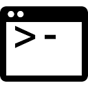

# 🪟 Windows

> 새로 받은 윈도우 PC 한 대를 명령어 한 줄로 co:code 팀 전체와 똑같은 개발환경으로 만들어주는 스크립트입니다.

이 안내는 [coco-de/desktop](../README.md) 저장소의 Windows 부분입니다.

[](https://www.microsoft.com/windows)
[](./win-setup.ps1)
[](https://learn.microsoft.com/windows/package-manager/)

이 폴더에서 보실 파일은 딱 두 개입니다.

- [`win-setup.ps1`](./win-setup.ps1) — 개발환경을 자동으로 설치해주는 스크립트
- `README.md` — 지금 보고 계신 이 문서

> 🍎 **맥북을 쓰신다면** [macos 폴더](../macos/)의 안내를 따르세요. 세 폴더는 **같은 도구 목록을 각자의 OS 방식으로** 설치합니다. 무엇이 어떻게 다른지는 [🍎 맥과 무엇이 다른가요](#vs-mac)에 정리해두었습니다.

## 목차

- [🙋 이런 분들을 위한 레포입니다](#who-is-this-for)
- [🚀 빠른 시작](#quickstart)
- [🧰 우리 팀의 기술 스택](#tech-stack)
- [📦 무엇이 설치되나요](#whats-installed)
- [🍎 맥과 무엇이 다른가요](#vs-mac)
- [✅ 설치 후 확인할 것](#after-install)
- [🔒 안전한가요](#is-it-safe)
- [🐛 문제가 생겼나요](#troubleshooting)
- [💬 도움이 필요하신가요](#get-help)

<br>

<a id="who-is-this-for"></a>

## 🙋 이런 분들을 위한 레포입니다

co:code는 엔지니어뿐 아니라 디자이너, PM도 하나의 엔지니어링 조직 아래에서 함께 일합니다. 그래서 **직군과 상관없이, 새로 합류한 모든 팀원이 이 스크립트 하나로 노트북을 세팅**합니다.

"나는 개발자가 아닌데 왜 개발환경 스크립트를 실행하지?" 라는 생각이 드신다면, 이렇게 이해해주시면 됩니다.

- 이 스크립트는 사실 여러 개의 앱과 도구를 하나씩 손으로 내려받아 설치하는 번거로운 과정을, PowerShell(글자로 명령을 내리는 화면)에서 대신 자동으로 처리해주는 프로그램일 뿐입니다.
- Slack, Figma, Chrome처럼 직군에 관계없이 매일 쓰는 앱들도 이 스크립트가 함께 설치해 드립니다.
- 팀 전체의 노트북 환경이 같으면, 누가 무엇을 도와줄 때 "제 컴퓨터에서는 되는데요?" 같은 상황 없이 서로 빠르게 도와줄 수 있습니다.
- 프로그래밍을 잘 모르셔도 괜찮습니다. 아래 [빠른 시작](#quickstart)만 따라 하시면 됩니다. 실행 중에는 지금 무엇을 하고 있는지 화면에 계속 안내 문구가 표시됩니다.
- 스크립트 코드는 이 저장소의 [`win-setup.ps1`](./win-setup.ps1) 하나뿐이고, 전체가 공개되어 있어 누구나 열어서 무슨 일을 하는지 읽어볼 수 있습니다.

<br>

<a id="quickstart"></a>

## 🚀 빠른 시작

### 준비물

- **Windows 10(빌드 17763 / 1809 이상) 또는 Windows 11이 설치된 PC. 이게 전부입니다.**

개발 도구를 미리 깔아둘 필요가 없습니다. 윈도우의 앱 설치 관리자(`winget`)가 없으면 **스크립트가 알아서 설치**하고(0단계), PowerShell 7도 없으면 자동으로 설치한 뒤 그쪽에서 다시 시작합니다.

> 💡 **winget이 뭔가요?** 맥의 Homebrew에 해당하는, 마이크로소프트 공식 앱 설치 관리자입니다. 이 스크립트가 설치하는 대부분의 앱은 winget을 통해 내려받아집니다. Windows 11에는 기본으로 들어 있고, 없으면 스크립트가 세 가지 방법을 차례로 시도해 자동 설치합니다.

> 💡 **Scoop은 뭔가요?** winget 목록에 없는 개발자용 도구를 **관리자 권한 없이** 내 계정 폴더에 설치해주는 보조 도구입니다. 이것도 스크립트가 알아서 설치합니다.

### 실행

**시작 메뉴 > `PowerShell`** 을 열고, 아래 한 줄을 붙여넣은 뒤 Enter를 누르세요.

```powershell
Set-ExecutionPolicy -Scope Process Bypass -Force; $s="$env:TEMP\win-setup.ps1"; iwr -UseBasicParsing https://raw.githubusercontent.com/coco-de/desktop/main/windows/win-setup.ps1 -OutFile $s; Unblock-File $s; & $s
```

맨 앞의 `Set-ExecutionPolicy` 는 **지금 열려 있는 이 창에서만** 스크립트 실행을 허용합니다(창을 닫으면 원래대로 돌아갑니다). 이게 없으면 윈도우 기본값에서 파일은 내려받아지지만 실행이 아무 설명 없이 조용히 막힙니다.

> ⏱ **설치에는 30분~2시간 정도 걸립니다.** Android SDK와 Visual Studio 빌드 도구가 수 GB짜리라 네트워크 속도에 따라 차이가 큽니다. 중간에 창을 닫지 마시고, 다른 일을 하셔도 됩니다.

> 🔐 **중간에 "이 앱이 디바이스를 변경하도록 허용하시겠어요?"(UAC) 창이 여러 번 뜹니다.** Chrome·Android Studio·Tailscale처럼 PC 전체에 설치되는 앱들 때문입니다. **예**를 눌러주세요.

<details>
<summary>레포를 clone해서 실행하고 싶다면</summary>

<br>

```powershell
git clone https://github.com/coco-de/desktop.git
cd desktop/windows
Set-ExecutionPolicy -Scope CurrentUser RemoteSigned -Force
.\win-setup.ps1
```

</details>

<details>
<summary>⚠️ 관리자 권한으로 실행해야 하나요? (짧은 답: 아니요)</summary>

<br>

**평소에는 일반 PowerShell로 실행하세요.** 스크립트 전체를 관리자로 돌리면 winget·fvm·pub이 설치한 것들이 *관리자 계정의 폴더*에 깔려서, 정작 평소 쓰는 터미널에서는 아무것도 안 보이는 2차 사고가 납니다.

다만 아래 세 가지는 윈도우가 관리자 권한을 요구합니다.

| 항목 | 왜 필요한가 |
|---|---|
| 개발자 모드 | Flutter가 쓰는 '바로가기(심볼릭 링크)' 생성 허용. **이게 꺼져 있으면 Flutter 앱 빌드가 실패합니다** |
| 긴 경로 허용 | 윈도우의 260자 경로 제한 해제. Gradle·pub 캐시 경로가 길어 자주 걸립니다 |
| 브라우저 확장 자동 등록 | ZenHub 확장을 Chrome·Edge에 미리 등록 |

일반 권한으로 실행하면 이 세 가지는 **방법만 안내하고 건너뜁니다.** 나중에 시작 메뉴에서 PowerShell을 마우스 오른쪽 클릭 → **관리자 권한으로 실행** 후 아래를 실행하면 그 부분만 마저 처리됩니다.

```powershell
.\win-setup.ps1 -SystemOnly
```

</details>

### 다시 실행할 때 쓰는 옵션

모든 단계는 **몇 번을 실행해도 안전**합니다(이미 설치된 건 건너뜁니다). 특정 부분만 다시 하고 싶을 때는 아래 옵션을 쓰세요.

| 옵션 | 하는 일 |
|---|---|
| (없음) | 전체 설치 (0~10단계) |
| `-EnvOnly` | 1Password에서 팀 공용 토큰만 다시 읽어 환경변수에 주입 |
| `-DartOnly` | Dart 글로벌 패키지만 다시 설치/업데이트 |
| `-SystemOnly` | 윈도우 시스템 설정(개발자 모드·긴 경로·브라우저 확장)만 다시 점검 — 관리자 권한 필요 |
| `-DefenderExclusions` | 빌드 캐시 폴더를 Defender 실시간 검사에서 제외 (**기본 꺼짐** · 보안 담당자 승인 후 · **관리자 권한 필요**) — 이 옵션을 붙이면 전체 설치는 시작되지 않고 윈도우 시스템 설정 단계만 돕니다 |
| `-EnableHyperV` | 안드로이드 에뮬레이터 가속(WHPX)을 실제로 켬 — 단독으로 쓰면 전체 설치 없이 가속만 켜고 끝냅니다 (**관리자 권한 필요** · 켠 뒤 재부팅) |
| `-Help` | 사용법 표시 |

<br>

<a id="tech-stack"></a>

## 🧰 우리 팀의 기술 스택

`win-setup.ps1` 하나로 co:code 팀 전체 PC에 실제로 세팅되는 앱·CLI·언어 런타임을 한눈에 모았습니다. 아이콘은 대부분 [Simple Icons](https://simpleicons.org)에서 받아 이 저장소의 [`assets/icons/`](./assets/icons)에 함께 보관하고 있습니다. Simple Icons에 없는 앱·도구는 실제 브랜드 아이콘을 받아 사용했고, 공식 브랜드 아이콘이 아직 없는 도구는 이름만 표기했습니다 (자세한 목록은 아래 표 끝의 각주 참고).

<br>

**📦 패키지 관리자** — 아래 도구 대부분이 이걸 통해 설치됩니다. 없으면 스크립트가 가장 먼저 자동으로 설치합니다.

<table>
<tr>
<td align="center" width="100"><br><sub><b>winget</b></sub></td>
<td align="center" width="100"><sub><b>Scoop</b><br>(보조)</sub></td>
<td align="center" width="100"></td>
<td align="center" width="100"></td>
<td align="center" width="100"></td>
</tr>
</table>

**🖥 GUI 앱**

<table>
<tr>
<td align="center" width="100"><br><sub><b>Android Studio</b></sub></td>
<td align="center" width="100"><br><sub><b>Slack</b></sub></td>
<td align="center" width="100"><br><sub><b>Figma</b></sub></td>
<td align="center" width="100"><br><sub><b>Claude Desktop</b></sub></td>
<td align="center" width="100"><br><sub><b>Google Chrome</b></sub></td>
</tr>
<tr>
<td align="center" width="100"><br><sub><b>1Password</b></sub></td>
<td align="center" width="100"><br><sub><b>Tailscale</b></sub></td>
<td align="center" width="100"><br><sub><b>Orca</b></sub></td>
<td align="center" width="100"><br><sub><b>Lumide</b></sub></td>
<td align="center" width="100"><br><sub><b>Zed</b></sub></td>
</tr>
<tr>
<td align="center" width="100"><br><sub><b>Rive</b></sub></td>
<td align="center" width="100"><sub><b>TrafficMonitor</b><br>(Stats 대체)</sub></td>
<td align="center" width="100"><sub><b>Pretendard</b><br>(폰트)</sub></td>
<td align="center" width="100"></td>
<td align="center" width="100"></td>
</tr>
</table>

**🛠 CLI 도구**

<table>
<tr>
<td align="center" width="100"><br><sub><b>git</b></sub></td>
<td align="center" width="100"><br><sub><b>go</b></sub></td>
<td align="center" width="100"><sub><b>pyenv-win</b></sub></td>
<td align="center" width="100"><br><sub><b>nvm-windows</b></sub></td>
<td align="center" width="100"><br><sub><b>gh</b></sub></td>
<td align="center" width="100"><sub><b>jq</b><br>(JSON 처리)</sub></td>
</tr>
<tr>
<td align="center" width="100"><sub><b>awscli</b></sub></td>
<td align="center" width="100"><br><sub><b>Docker Desktop</b></sub></td>
<td align="center" width="100"><sub><b>direnv</b></sub></td>
<td align="center" width="100"><br><sub><b>lefthook</b><br>(Git 훅)</sub></td>
<td align="center" width="100"><br><sub><b>JDK 17</b><br>(Temurin)</sub></td>
<td align="center" width="100"><br><sub><b>VS Build Tools</b><br>(C++)</sub></td>
</tr>
<tr>
<td align="center" width="100"><br><sub><b>Claude Code</b></sub></td>
<td align="center" width="100"><br><sub><b>codex</b><br>(OpenAI)</sub></td>
<td align="center" width="100"><br><sub><b>agy</b><br>(Antigravity)</sub></td>
<td align="center" width="100"><br><sub><b>slack</b><br>(Slack CLI)</sub></td>
<td align="center" width="100"><br><sub><b>op</b><br>(1Password CLI)</sub></td>
<td align="center" width="100"><br><sub><b>ccstatusline</b><br>(상태줄)</sub></td>
</tr>
</table>

**🐦 Flutter / Dart**

<table>
<tr>
<td align="center" width="100"><br><sub><b>fvm</b></sub></td>
<td align="center" width="100"><br><sub><b>DCM</b></sub></td>
<td align="center" width="100"><br><sub><b>serverpod_cli</b></sub></td>
<td align="center" width="100"><br><sub><b>marionette_mcp</b></sub></td>
<td align="center" width="100"><br><sub><b>mcp_server_dart</b></sub></td>
<td align="center" width="100"><br><sub><b>cob</b><br>(co-bricks)</sub></td>
</tr>
<tr>
<td align="center" width="100"><br><sub><b>flutterfire_cli</b></sub></td>
<td align="center" width="100"><br><sub><b>coverage</b></sub></td>
<td align="center" width="100"><br><sub><b>melos</b></sub></td>
<td align="center" width="100"><br><sub><b>mason_cli</b></sub></td>
<td align="center" width="100"><br><sub><b>flutter_gen</b></sub></td>
<td align="center" width="100"><br><sub><b>jaspr_cli</b></sub></td>
</tr>
</table>

**☁️ 클라우드 / 🐍 언어 런타임**

<table>
<tr>
<td align="center" width="100"><br><sub><b>gcloud</b></sub></td>
<td align="center" width="100"><br><sub><b>Python</b></sub></td>
<td align="center" width="100"><br><sub><b>Node.js</b></sub></td>
<td align="center" width="100"><br><sub><b>npm</b></sub></td>
</tr>
</table>

**💻 터미널 환경**

<table>
<tr>
<td align="center" width="100"><br><sub><b>PowerShell 7</b></sub></td>
<td align="center" width="100"><br><sub><b>Oh My Posh</b></sub></td>
<td align="center" width="100"><sub><b>PSReadLine</b><br>(자동 제안·색상)</sub></td>
<td align="center" width="100"><sub><b>MesloLGS NF</b><br>(폰트)</sub></td>
</tr>
</table>

<br>

<sub>※ Slack · Orca · Lumide · codex(OpenAI) · agy(Antigravity)는 Simple Icons에 없어, 실제 브랜드 아이콘(파비콘)을 받아 사용했습니다. PowerShell 아이콘은 [PowerShell 공식 저장소](https://github.com/PowerShell/PowerShell)의 배포 자산이고, Oh My Posh는 [ohmyposh.dev](https://ohmyposh.dev)의 파비콘입니다. winget · Visual Studio Build Tools는 마이크로소프트 제품이라 마이크로소프트 로고로 표기했습니다. Scoop, awscli, pyenv-win, direnv, jq, PSReadLine, TrafficMonitor, MesloLGS NF, Pretendard는 공식 브랜드 아이콘이 없어 텍스트로만 표기했습니다. DCM · coverage · melos · mason_cli · flutter_gen · jaspr_cli · serverpod_cli · marionette_mcp · mcp_server_dart · cob(co-bricks)는 Dart 생태계 도구라 Dart 아이콘으로 대신 표기했습니다. op(1Password CLI)는 1Password의 커맨드라인 버전이라 1Password 아이콘을 함께 사용했습니다. ccstatusline은 Claude Code 상태줄 도구라 Claude 아이콘으로 대신 표기했습니다.</sub>

<br>

<a id="whats-installed"></a>

## 📦 무엇이 설치되나요

| 분류 | 항목 |
|---|---|
| 📦 패키지 관리자 | **winget**(마이크로소프트 공식 앱 설치 관리자 — 없으면 ① 계정 재등록 → ② 공식 PowerShell 모듈 → ③ GitHub 릴리스 직접 설치 순으로 자동 설치), **Scoop**(관리자 권한 없이 쓰는 예비 패키지 관리자 · extras·versions·java 버킷 등록 — 현재 팀 표준 도구는 전부 winget·공식 설치 스크립트로 깔리고, Scoop 은 예비용으로만 준비해 둡니다) |
| 🖥 GUI 앱 | Android Studio, Slack, Figma, Claude Desktop, Google Chrome, 1Password, Tailscale, Orca, Lumide, Zed, Rive, TrafficMonitor(작업표시줄 시스템 모니터 — 최초 1회 직접 실행 필요), Pretendard 폰트(9개 스타일: Thin~Black) |
| 🪟 윈도우 시스템 설정 | **개발자 모드**(Flutter가 쓰는 심볼릭 링크 허용 — 꺼져 있으면 빌드가 실패합니다), **긴 경로 허용**(260자 제한 해제), **Git 긴 경로 지원**(`core.longpaths`). 셋 다 관리자 권한이 있을 때만 자동 적용되고, 없으면 켜는 방법만 안내합니다 (재부팅 후 적용) |
| 🧩 브라우저 확장 프로그램 | Chrome·Edge에 [ZenHub for GitHub](https://chromewebstore.google.com/detail/zenhub-for-github/ogcgkffhplmphkaahpmffcafajaocjbd) 확장을 레지스트리 '외부 확장' 방식으로 자동 등록(관리자 권한 필요) — 브라우저를 실행하면 확인 창이 뜨고, 거기서 '확장 사용'을 눌러야 켜집니다. 강제설치 정책은 일부러 쓰지 않습니다([이유](#vs-mac)) |
| 🌐 브라우저 번역 언어 | Chrome·Edge의 번역 대상 언어를 한국어로, "번역 안 함" 목록을 영어로 자동 설정 — 브라우저가 실행 중이면 건너뛰고 경고만 표시 |
| 🔌 Claude MCP | figma 플러그인 자동 설치 + marionette·dart MCP, zenhub·jira·slack MCP 자동 등록. `ZENHUB_API_TOKEN`·`JIRA_API_TOKEN`·`SLACK_TEAM_ID`·`SLACK_BOT_TOKEN`(팀 공용 토큰)은 1Password CLI(`op`)로 **윈도우 사용자 환경변수**에 자동 주입 — git에 커밋 안 됨 (⚠️ figma는 최초 1회 `/mcp` OAuth 로그인. jira는 `sooperset/mcp-atlassian`(Docker)로 Jira REST API에 직접 붙어 조직 Rovo 권한이 필요 없음 — 런타임에 **Docker Desktop이 실행 중**이어야 함) |
| 🔑 팀 공용 토큰 | 위 4종에 더해, 다국어 자동 번역 도구 `slang_gpt`가 쓰는 `SLANG_GPT_API_KEY`, DCM을 CI 모드로 인증하는 `DCM_EMAIL`·`DCM_CI_KEY`, TypeSafe(판단형 AI 모델 Jev) SDK가 쓰는 `TYPESAFE_API_KEY`(1Password 항목 `TypeSafe Jev`)도 같은 방식(1Password CLI → 윈도우 사용자 환경변수)으로 자동 주입 ([설정 방법](#after-install)) |
| 🔑 GitHub 인증(gh) | coco-de 조직의 비공개 레포(`co-bricks`·`skills`) 접근용 로그인을 팀 공용 1Password 토큰으로 자동 처리(`gh auth login` + `gh auth setup-git`) — 이미 인증돼 있으면 건너뜀 |
| 🧩 cocode-skills 팀 플러그인 | 사설 레포 `coco-de/skills` 설치 스크립트로 cc-\* 플러그인 번들 동기화 (⚠️ **현재 윈도우에서는 자동 설치가 되지 않습니다** — 아래 [알려진 제약](#known-gap) 참고) |
| 📱 Android SDK | cmdline-tools, platform-tools, build-tools, platforms, NDK, 에뮬레이터 시스템 이미지, AVD까지 전부 자동 설치·구성 (Android Studio 첫 실행 마법사 불필요). NDK는 최신이 아니라 **Flutter stable이 요구하는 버전으로 고정** 설치 |
| 🛠 CLI 도구 | git(Git for Windows — Flutter가 요구하는 심볼릭 링크·줄바꿈 옵션까지 지정), go, pyenv-win, nvm-windows, gh, jq, awscli, Docker Desktop, direnv, lefthook(레포별로 최초 1회 `lefthook install` 필요), JDK 17(Temurin), Visual Studio 2022 Build Tools(C++ 워크로드 — 윈도우 데스크톱 앱 빌드용), Claude Code, ccstatusline → 실패 시 Awesome CC Statusline(small), codex, agy(Antigravity CLI), slack(Slack CLI), op(1Password CLI) |
| ✉️ Git 설정 | 커밋에 사용할 회사 이메일을 실행 중에 입력받아 전역 설정(`git config --global user.email`) — 이미 설정돼 있으면 묻지 않고 건너뜀 |
| 🐦 Flutter | fvm(버전 관리자 · 공식 zip을 `%LOCALAPPDATA%\fvm-bin`에 설치)으로 Flutter stable 채널 글로벌 설정, DCM(Dart 코드 품질 검사 도구) |
| 🎯 Dart 글로벌 패키지 | coverage, melos, mason_cli, flutter_gen, jaspr_cli, serverpod_cli(pub.dev 최신 베타/RC 버전 자동 조회), flutterfire_cli, marionette_mcp, mcp_server_dart, cob(co-bricks) (⚠️ cob은 비공개 레포라 GitHub 인증 필요) · 나중에 이 목록만 다시 깔려면 `.\win-setup.ps1 -DartOnly` |
| ☁️ 클라우드 | Google Cloud CLI (gcloud) |
| 🐍 언어 런타임 | Python 최신 3.x (pyenv-win), Node.js LTS + npm (nvm-windows — ⚠️ 설치에 관리자 권한 필요, 없으면 fnm으로 자동 대체) |
| 💻 터미널 환경 | PowerShell 7, Oh My Posh(`powerlevel10k_rainbow` 테마), PSReadLine(자동 제안·구문 색상), MesloLGS NF 폰트 + Windows Terminal 폰트 자동 적용, 팀 공용 PowerShell 프로필 블록 |

모든 항목은 이미 설치되어 있으면 건너뛰도록 되어 있어, 스크립트를 여러 번 실행해도 안전합니다.

<a id="known-gap"></a>

> ### ⚠️ 알려진 제약 — cocode-skills 팀 플러그인
>
> 맥에서는 `coco-de/skills` 레포의 `install.sh`가 팀 전용 Claude Code 플러그인(cc-flutter·cc-dev·cc-coui 등)을 동기화해줍니다. **이 스크립트는 윈도우에서 그 단계를 자동으로 마치지 못합니다.**
>
> `install.sh`가 `rsync`에 의존하는데, `rsync`는 Git for Windows에 들어 있지 않고 winget·Scoop 정식 패키지도 없어졌기 때문입니다. 스크립트는 `install.ps1`이 있으면 그걸 먼저 쓰고, 없으면 Git Bash로 `install.sh` 실행을 시도한 뒤 실패하면 경고만 남기고 계속 진행합니다.
>
> **근본 해결은 `coco-de/skills` 레포 쪽에서 해야 합니다** — `install.ps1`을 추가하거나, `install.sh`에 `rsync`가 없을 때 `cp -a`로 넘어가는 폴백을 넣으면 됩니다. 그 전까지 윈도우 팀원은 플러그인 폴더를 직접 복사해서 쓰셔야 합니다.

<details>
<summary>도구별 상세 설명 펼쳐보기 (하나하나 뭔지 궁금하신 분만)</summary>

<br>

**패키지 관리자**

| | 도구 | 용도 |
|---|---|---|
|  | winget (앱 설치 관리자) | 윈도우 공식 앱 설치 관리자. 맥의 Homebrew에 해당하며, 아래 GUI 앱 대부분이 winget으로 설치됩니다. 없으면 스크립트가 0단계에서 ① 계정 재등록 → ② 마이크로소프트 공식 PowerShell 모듈(`Repair-WinGetPackageManager`) → ③ GitHub 릴리스 직접 설치 순으로 자동 설치를 시도합니다 (Windows 10 1809 / 빌드 17763 이상 필요) |
| | Scoop | 관리자 권한 없이 내 계정 폴더(`~\scoop`)에 CLI 도구를 설치하는 보조 패키지 관리자. winget에 없는 도구를 여기서 받습니다. 버킷(설치 목록 저장소) extras·versions·java를 함께 등록합니다 |

**GUI 앱**

| | 도구 | 용도 |
|---|---|---|
|  | Android Studio | 안드로이드 앱 개발 IDE (Flutter 개발에도 사용). winget `Google.AndroidStudio` · ⚠ 설치 중 관리자 승인(UAC) 창이 뜨고, ARM64 노트북용 설치본이 없어 ARM PC에서는 건너뜁니다 |
|  | Slack | 팀 커뮤니케이션. winget `SlackTechnologies.Slack` (사용자 범위 설치 · 관리자 권한 불필요) |
|  | Figma | 디자인 툴. winget `Figma.Figma` (사용자 범위 설치) |
|  | Claude Desktop | Claude AI 어시스턴트 데스크톱 앱. winget `Anthropic.Claude` (터미널용 Claude Code는 별개 도구입니다) |
|  | Google Chrome | 웹 브라우저. 맥 세팅의 Dia 브라우저가 윈도우판이 없어, 윈도우에서는 Chrome이 그 자리를 대신합니다. winget `Google.Chrome` · ⚠ 관리자 승인 창이 뜹니다 |
|  | 1Password | 비밀번호 관리자. 팀 공용 토큰을 읽어 오는 단계에서 이 앱의 CLI 통합 설정이 켜져 있어야 합니다. winget `AgileBits.1Password` |
|  | op (1Password CLI) | 1Password 금고를 **터미널에서** 열어보는 명령. 팀 공용 ZenHub·Jira·Slack·TypeSafe 등의 토큰을 금고에서 읽어 윈도우 사용자 환경변수에 자동으로 넣어주고, GitHub PAT로 `gh auth login`까지 대신 처리합니다. winget `AgileBits.1Password.CLI` |
|  | Tailscale | 팀 내부망 접속용 VPN 메시 네트워크. winget `Tailscale.Tailscale` · ⚠ 네트워크 드라이버와 서비스를 설치하므로 관리자 승인이 반드시 필요합니다 |
|  | Orca | AI 코딩 에이전트 도구. 맥과 달리 별도 저장소(탭) 추가 없이 winget 기본 목록(`StablyAI.Orca`)에서 바로 설치됩니다 · ⚠ x64 전용이라 ARM64 노트북에서는 건너뜁니다 |
|  | Lumide | 에이전트 네이티브 코드 에디터 IDE ([lumide.dev](https://lumide.dev)). 윈도우판은 설치 프로그램이 아니라 압축(zip) 형태라, `%LOCALAPPDATA%\Programs\Lumide`에 풀고 시작 메뉴 바로가기를 자동으로 만들어 줍니다 · ⚠ 자동 업데이트가 없어 새 버전은 스크립트를 다시 실행해 받아야 합니다. 실행에 필요할 수 있는 마이크로소프트 공용 부품(winget `Microsoft.VCRedist.2015+.x64`)도 관리자 승인이 가능할 때 함께 설치합니다 |
|  | Zed | 협업 기능이 내장된 코드 에디터 ([zed.dev](https://zed.dev)). winget `ZedIndustries.Zed` (x64/arm64 모두 지원) |
|  | Rive | 인터랙티브 애니메이션·모션 그래픽 디자인 툴 ([rive.app](https://rive.app)). winget에 없어 공식 사이트의 스토어 앱 파일(MSIX)을 직접 받아 설치합니다 · ⚠ 회사 정책으로 '외부 앱 설치(사이드로드)'가 막혀 있으면 실패하며, 그때는 브라우저 에디터([editor.rive.app](https://editor.rive.app))를 쓰면 됩니다 |
| | TrafficMonitor | 작업표시줄에 CPU·메모리·네트워크 사용량을 띄워 주는 시스템 모니터. 맥 세팅의 Stats(메뉴막대 앱)를 대신합니다. winget `zhongyang219.TrafficMonitor.Full` · ⚠ 설치만으로는 나타나지 않고 최초 1회 직접 실행해야 합니다 |
| | Pretendard (한글 폰트 9종) | Figma 시안 등 디자인 작업에서 널리 쓰이는 한글 폰트. 9개 굵기(Thin~Black)를 한 번에 설치해, 로컬에 폰트가 없어 시안과 다르게 렌더링되는 문제를 막아 줍니다. winget/Scoop에 없어 GitHub 공식 릴리스(`orioncactus/pretendard`) zip을 받아 계정별 폰트 폴더에 직접 설치합니다(관리자 권한 불필요) · ⚠ 이미 열려 있는 앱은 껐다 켜야 폰트 목록에 나타납니다 |

**윈도우 시스템 설정 (맥에는 없는 윈도우 전용 단계)**

| 항목 | 왜 필요한가 |
|---|---|
| 개발자 모드 | Flutter·fvm이 '바로가기(심볼릭 링크)'를 만들 수 있게 허용합니다. **꺼져 있으면 설치는 전부 성공했는데 앱 빌드만 실패**해서, 윈도우 세팅에서 가장 흔한 실패 원인입니다. 레지스트리 `AllowDevelopmentWithoutDevLicense=1` (관리자 권한 필요) |
| 긴 경로 허용 | 윈도우 기본 260자 경로 제한을 풉니다. Flutter는 패키지 캐시·자동 생성 코드 때문에 경로가 길어져 이 제한에 자주 걸립니다. 레지스트리 `LongPathsEnabled=1` (관리자 권한 필요 · 재부팅 후 적용) |
| Git 긴 경로 지원 | `git clone`·`checkout`이 긴 파일 경로에서 실패하지 않게 합니다. `git config --system core.longpaths true` → 관리자 권한이 없으면 `--global`로 자동 폴백 |
| git 안전 폴더 | fvm이 받아 둔 Flutter SDK 폴더를 git이 '남의 폴더'로 보고 거부하지 않게 합니다. 이게 없으면 엉뚱하게 `unable to find git` 오류가 납니다(윈도우 전용 함정). `git config --global --add safe.directory "*"` |
| 보안 기능 안내 | 방화벽 인바운드 허용 팝업, 제어된 폴더 액세스 차단, 실시간 검사로 인한 빌드 지연 — 스크립트는 **설정을 바꾸지 않고 안내만** 합니다 |

**Android SDK (자동 설치·구성)**

Android Studio 앱만 설치하면 SDK는 비어 있어서, 원래는 앱을 한 번 실행해 설치 마법사를 직접 눌러가며 구성 요소를 받아야 합니다. 이 스크립트는 구글 공식 `cmdline-tools`를 직접 받아 표준 위치(`%LOCALAPPDATA%\Android\Sdk`)에 배치하고, 아래 항목을 전부 커맨드라인에서 자동으로 설치·구성합니다.

| 도구 | 용도 |
|---|---|
| cmdline-tools | Android SDK를 터미널에서 다루는 도구 모음 (`sdkmanager`, `avdmanager`). 구글 공식 zip을 부트스트랩으로 쓴 뒤, 그것으로 최신본을 표준 위치에 정식 설치합니다 |
| platform-tools | `adb` 등 기기·에뮬레이터와 통신하는 도구 |
| build-tools / platforms | 최신 안정 버전을 `sdkmanager --list` 출력에서 자동으로 찾아 설치 (rc·beta 같은 프리뷰는 제외) |
| NDK | 네이티브(C/C++) 코드가 포함된 안드로이드 빌드에 필요. 최신이 아니라 **Flutter stable이 요구하는 버전으로 고정 설치**합니다 — 목록상의 최신 NDK는 프리뷰라 그대로 깔면 Gradle 빌드에서 버전 불일치가 납니다 |
| 에뮬레이터 + 시스템 이미지 | 실제로 배포된 `google_apis` 이미지 중 가장 최신 API 버전을 골라 설치. **일반 x64 PC에서만** 설치합니다 |
| AVD | 위 시스템 이미지로 `Pixel_6_API_<버전>` 이름의 가상 기기를 자동 생성 (이미 있으면 건너뜀) |
| 라이선스 자동 동의 | 맥의 `yes |` 대신, 'y'를 여러 줄 적은 임시 파일을 표준 입력으로 물려 처리합니다. 성공 판정은 종료 코드가 아니라 `licenses` 폴더에 파일이 생겼는지로 합니다 |
| 환경변수 + PATH | `ANDROID_HOME`·`ANDROID_SDK_ROOT`·`JAVA_HOME`·`ANDROID_NDK_HOME`을 **영구(레지스트리) + 지금 열린 창** 양쪽에 설정합니다 |
| 가속 진단 (WHPX) | `emulator -accel-check`로 **진단만** 합니다. 켜려면 관리자 PowerShell에서 `.\win-setup.ps1 -EnableHyperV` 를 실행하세요(전체 설치 없이 가속만 켜고 끝납니다) |

> ⚠️ **Windows on ARM(스냅드래곤) 노트북에서는 에뮬레이터를 쓸 수 없습니다.** 구글이 Android 에뮬레이터의 Windows ARM64용 빌드를 배포하지 않기 때문입니다. 스크립트는 ARM64를 감지하면 시스템 이미지·에뮬레이터·AVD 단계만 건너뛰고, SDK·NDK·build-tools 설치와 빌드는 그대로 진행합니다 — **실기기를 USB로 연결해** 개발하시면 됩니다.

**CLI 도구**

| | 도구 | 용도 |
|---|---|---|
|  | git (Git for Windows) | 버전 관리 시스템. Flutter가 요구하는 설정(심볼릭 링크 허용·줄바꿈 자동 변환 끔·일반 터미널에서 git 사용)을 설치할 때 함께 지정합니다. winget `Git.Git` |
|  | go | Go 프로그래밍 언어. winget `GoLang.Go` (+ `%USERPROFILE%\go\bin`을 사용자 PATH에 등록) |
| | pyenv-win | 여러 Python 버전을 관리하는 도구(맥 pyenv 대체). 공식 설치 스크립트(`install-pyenv-win.ps1`)로 `%USERPROFILE%\.pyenv` 에 설치 + `PYENV`·`PYENV_ROOT`·`PYENV_HOME` 환경변수와 `bin`·`shims` 를 PATH **맨 앞**에 등록 (Scoop 판은 설치 위치가 달라 환경변수와 어긋나므로 쓰지 않습니다) |
|  | nvm-windows | 여러 Node.js 버전을 관리하는 도구(맥 nvm 대체). winget `CoreyButler.NVMforWindows` · ⚠ **설치에 관리자 권한이 필요**하고, 기존 Node.js가 깔려 있으면 충돌하므로 건너뜁니다. 실패 시 `fnm`(관리자 권한 불필요)으로 자동 대체 |
|  | gh (GitHub CLI) | GitHub를 터미널에서 다루는 도구. coco-de 비공개 레포 접근 로그인은 팀 공용 1Password 토큰으로 자동 처리됩니다. winget `GitHub.cli` |
| | jq | JSON 형식의 데이터를 터미널에서 다루는 도구. winget `jqlang.jq` · ⚠ PowerShell에서는 필터를 작은따옴표가 아니라 큰따옴표로 감싸야 합니다 |
| | awscli | AWS(아마존 클라우드)를 터미널에서 다루는 도구. winget `Amazon.AWSCLI` |
|  | Docker Desktop | 컨테이너 실행 환경. 맥의 colima + docker 자리를 대신합니다. winget `Docker.DockerDesktop` · ⚠ 재부팅 후 앱을 한 번 실행해야 `docker` 명령이 붙습니다. `docker compose`(하이픈 없음)가 내장돼 있어 따로 깔지 않습니다 |
| | direnv | 폴더별로 필요한 환경 변수를 자동으로 불러와 주는 도구. winget `direnv.direnv` + PowerShell 프로필에 훅 한 줄 자동 등록 |
|  | lefthook | 커밋·푸시 직전에 코드 정리·검사·테스트를 자동으로 돌려주는 **Git 훅 관리자**. winget `evilmartians.lefthook` · 이 스크립트는 도구만 설치하며, 실제로 켜는 건 레포마다 한 번씩입니다 — `lefthook.yml`이 있는 프로젝트 폴더에서 `lefthook install` |
|  | JDK 17 (Temurin) | 자바 17 (안드로이드 빌드에 필요). winget `EclipseAdoptium.Temurin.17.JDK` — 설치 프로그램이 `JAVA_HOME`을 자동으로 잡아 주기 때문에 Microsoft OpenJDK 대신 이걸 씁니다 |
|  | Visual Studio 2022 Build Tools | 윈도우 데스크톱 앱을 빌드할 때 필요한 C++ 도구 모음 (맥에서 Xcode가 필요한 것과 같은 역할). 무거운 Visual Studio 전체판은 필요 없습니다. winget `Microsoft.VisualStudio.2022.BuildTools` · ⚠ 수 GB 다운로드 |
|  | Claude Code | 터미널에서 대화하듯 코드를 작성·수정하는 Claude CLI. 공식 스크립트(`claude.ai/install.ps1`)로 `%USERPROFILE%\.local\bin`에 설치 (실패 시 폴백: winget `Anthropic.ClaudeCode`) · ⚠ 네이티브 윈도우에서는 샌드박스 기능이 지원되지 않습니다 |
|  | ccstatusline / awesome-statusline | Claude Code 하단 상태줄을 모델·세션 비용·컨텍스트 사용량·git 상태까지 보여주는 정보 표시줄로 바꿔 줍니다. ccstatusline은 대화형이라 자동 등록에 대개 실패하며, 그때 Awesome CC Statusline(크기 `small`)이 자동으로 대신 설치됩니다 |
|  | codex | OpenAI의 터미널 AI 코딩 에이전트. 공식 스크립트(`chatgpt.com/codex/install.ps1`, 폴백: winget `OpenAI.Codex`) · 처음 실행할 때 ChatGPT 계정으로 로그인 |
|  | agy (Antigravity CLI) | Google의 터미널 AI 코딩 에이전트. 은퇴한 Gemini CLI의 공식 후속 도구. 공식 스크립트(`antigravity.google/cli/install.ps1`)로 `%LOCALAPPDATA%\agy\bin`에 설치 · 처음 실행할 때 Google 계정으로 로그인 |
|  | slack (Slack CLI) | Slack 앱/워크플로 개발용 공식 CLI. 윈도우 전용 공식 스크립트(`install-windows.ps1`, PowerShell 7 필요). 직접 앱을 만들려면 최초 1회 `slack login` 필요 (Claude Code의 `slack` MCP는 팀 공용 토큰으로 별도 인증됩니다) |

**Flutter / Dart**

| | 도구 | 용도 |
|---|---|---|
|  | fvm | Flutter 버전 관리자. `fvm global stable --force`로 stable 채널을 기본 버전으로 지정합니다. 공식 zip을 `%LOCALAPPDATA%\fvm-bin`에 풀고 PATH 등록 (관리자 권한 불필요) |
|  | DCM (Dart Code Metrics) | Dart 코드 품질 검사 도구. Chocolatey가 있으면 `choco install dcm`, 없으면 공식 GitHub 배포 zip을 `%LOCALAPPDATA%\dcm`에 풀고 PATH 등록. CI 인증 키(`DCM_EMAIL`·`DCM_CI_KEY`)는 1Password 항목 `DCM CI CD`에서 자동 주입 |
|  | coverage | 테스트가 코드의 어느 부분까지 확인했는지(커버리지)를 측정해 리포트로 만들어 줍니다 |
|  | melos | 여러 패키지를 한 레포에 담은 프로젝트(모노레포)의 의존성 설치·스크립트 실행을 한 번에 처리해 줍니다 |
|  | mason_cli | 미리 만들어 둔 코드 템플릿(brick)으로 새 화면·기능의 뼈대를 찍어내는 도구. 아래 `cob`이 이 위에서 동작합니다 |
|  | flutter_gen | 이미지·폰트 같은 파일과 색상을 코드에서 오타 없이 쓰도록 Dart 코드로 자동 생성해 줍니다 |
|  | jaspr_cli | Dart로 웹사이트를 만드는 Jaspr 프레임워크의 CLI |
|  | serverpod_cli | Serverpod 백엔드 프레임워크 CLI. pub.dev API로 지금 시점 실제 최신 버전(안정판 latest에 안 잡히는 베타·RC 포함)을 조회해 그 버전으로 설치하므로, 4.x → 5.x처럼 major가 올라가도 손대지 않아도 자동으로 따라갑니다 (조회 실패 시에만 안정판으로 대체 설치) |
|  | flutterfire_cli | Flutter 프로젝트를 Firebase와 연동해주는 CLI. pub.dev 공개 패키지라 GitHub 인증 없이 설치됩니다 |
|  | marionette_mcp | Claude Code의 `marionette` MCP 서버 — 실행 중인 Flutter 앱을 위젯 단위로 조작합니다 |
|  | mcp_server_dart | Claude Code의 `dart` MCP 서버 — 코드 분석·핫 리로드·패키지 탐색을 Claude가 직접 하게 해줍니다 |
|  | cob (co-bricks) | Mason bricks 동기화·관리 CLI. `cc-bricks` 플러그인이 Feature/프로젝트를 빠르게 생성할 때 사용합니다 · ⚠ 비공개 레포라 GitHub 인증(`gh auth login` + **`gh auth setup-git`**)이 먼저 돼 있어야 합니다 |

**클라우드 / 언어 런타임**

| | 도구 | 용도 |
|---|---|---|
|  | gcloud (Google Cloud CLI) | Google Cloud를 터미널에서 다루는 도구. winget `Google.CloudSDK` → 실패하면 구글 공식 설치 파일로 자동 대체. 윈도우판은 Python이 함께 들어 있습니다 |
|  | Python 최신 3.x | pyenv-win으로 설치되는 최신 안정 버전, `pyenv global`로 기본 지정 |
|  | Node.js LTS + npm | nvm-windows로 설치, `nvm use lts`로 지정 · ⚠ 윈도우판은 `nvm install --lts`가 아니라 `nvm install lts`이고 `nvm alias default`가 없습니다 — `nvm use` 한 번이면 모든 창과 재부팅에 영구 적용됩니다 |

**터미널 환경**

| | 도구 | 용도 |
|---|---|---|
|  | PowerShell 7 (pwsh) | 팀 표준 셸. 윈도우에 기본 탑재된 '윈도우 PowerShell 5.1'과 동작이 달라, 스크립트는 없으면 자동으로 설치한 뒤(winget `Microsoft.PowerShell`) **PowerShell 7에서 스스로 다시 시작**합니다 |
| | PowerShell 프로필 (Profile.ps1) | 터미널을 열 때마다 자동으로 읽히는 팀 공용 설정 파일. 맥의 `~/.zshrc` 자리입니다. 자동 제안·구문 색상·한글(UTF-8) 출력 설정이 들어갑니다. **마커로 감싼 블록만 갱신**하므로 개인 설정은 보존됩니다. 이전 PC의 설정을 그대로 옮기고 싶다면 그 PC의 `Profile.ps1`(`$PROFILE.CurrentUserAllHosts`)을 **`win-setup.ps1` 과 같은 폴더에 복사한 뒤 clone 방식으로 실행**하세요 — 프로필이 아직 없는 PC라면 그 파일을 출발점으로 삼습니다(한 줄 실행에는 '옆 폴더'가 없어 동작하지 않습니다) |
|  | Oh My Posh | 터미널 프롬프트에 현재 폴더·git 브랜치·실행 시간을 예쁘게 보여 주는 도구. winget `JanDeDobbeleer.OhMyPosh`(실패 시 공식 `ohmyposh.dev/install.ps1`) · 맥 powerlevel10k 대체이며, 테마도 p10k를 그대로 옮겨 온 공식 테마 `powerlevel10k_rainbow`를 씁니다 |
| | PSReadLine | 예전에 친 명령을 회색으로 미리 보여 주고(→ 키로 수락), 명령줄에 구문 색상을 입힙니다. 맥의 `zsh-autosuggestions` + `zsh-syntax-highlighting` 대체 (PowerShell 7 기본 탑재) |
| | MesloLGS NF (폰트) | 프롬프트 아이콘이 네모(□)로 깨지지 않게 하는 특수 폰트. **맥 스크립트와 폰트 이름까지 완전히 동일합니다.** 설치 후 Windows Terminal의 기본 글꼴로 자동 적용까지 해 줍니다 (맥의 Terminal.app AppleScript 단계에 해당). Windows Terminal 자체가 없으면 winget `Microsoft.WindowsTerminal`로 함께 설치합니다 |

</details>

<br>

<a id="vs-mac"></a>

## 🍎 맥과 무엇이 다른가요

[macos](../macos/)와 이 폴더는 **같은 도구 목록을 각자의 OS 방식으로** 설치합니다. 아래는 실제로 달라지는 부분입니다.

### 대체된 것

| 맥 (macos) | 윈도우 (windows) | 왜 |
|---|---|---|
| Homebrew | **winget + Scoop** | 윈도우 공식 앱 설치 관리자 + 관리자 권한 없이 쓰는 보조 도구 |
| Dia (브라우저) | **Google Chrome / Edge** | Dia는 아직 윈도우 정식 빌드가 없습니다(비공개 베타 단계) |
| Stats (메뉴막대) | **TrafficMonitor** | 메뉴막대는 macOS 개념. 작업표시줄에 같은 정보를 띄웁니다 |
| colima + docker | **Docker Desktop** | colima는 맥/리눅스 전용. 윈도우는 WSL2가 그 역할을 합니다 |
| oh-my-zsh + powerlevel10k | **PowerShell 프로필 + Oh My Posh** | zsh 자체가 없습니다. 테마는 p10k를 옮겨 온 공식 테마 `powerlevel10k_rainbow` |
| zsh-autosuggestions / zsh-syntax-highlighting | **PSReadLine** | PowerShell 7에 기본 탑재. 회색 인라인 제안과 수락 키까지 동작이 같습니다 |
| `~/.zshrc`에 `export`로 토큰 주입 | **윈도우 사용자 환경변수** | 윈도우의 프로필 파일은 '문서' 폴더에 있어 **OneDrive로 자동 백업**됩니다. 파일에 적으면 토큰이 클라우드로 올라갑니다 |
| Terminal.app 폰트 (AppleScript) | **Windows Terminal `settings.json`** | 둘 다 "폰트를 깔았어도 터미널이 그걸 쓰게 만들어야 한다"는 같은 문제를 해결합니다 |
| Xcode + CocoaPods | **Visual Studio Build Tools** | 데스크톱 앱 빌드에 필요한 C++ 도구. iOS 빌드는 윈도우에서 불가능합니다 |
| openjdk@17 (brew) | **Temurin JDK 17** | winget 설치 프로그램이 `JAVA_HOME`을 자동으로 잡아 줍니다 |
| Orca 전체 디스크 접근 권한(9단계) | **개발자 모드 + 긴 경로 허용** | 윈도우에는 macOS의 TCC 같은 중앙 권한 게이트가 없습니다. 대신 윈도우에서 실제로 사람을 막는 항목으로 그 자리를 채웠습니다 |

### 빠진 것 (윈도우에서 불가능하거나 무의미)

| 항목 | 왜 빠졌나 |
|---|---|
| **cocoapods** | iOS 라이브러리 의존성 관리자. 윈도우에는 Xcode가 없어 Flutter의 iOS 타깃을 아예 빌드할 수 없습니다. 윈도우 담당자는 Android·Web·Windows 타깃을 맡고, iOS 빌드는 맥 장비나 CI의 macOS 러너에서 처리합니다 |
| **fastlane** | 윈도우에서는 Xcode 의존 기능이 전부 동작하지 않아 Android 레인만 남습니다. Ruby 런타임까지 추가로 필요해 실패 지점이 많아 팀 표준에서 제외했습니다. Android 릴리스 자동화는 Gradle 태스크나 GitHub Actions에서 처리합니다 |
| **mas (App Store CLI)** | Mac App Store 전용 |
| **서명 키체인 로그인 자동 해제** (`--keychains-only`) | macOS의 login 키체인·Security.framework·LaunchAgent를 사용하는 설정입니다. Apple 앱·패키지 서명용 Mac에서 [선택형 설정](../macos/signing-keychains/)을 실행합니다 |
| **docker-compose (하이픈 있는 별도 패키지)** | Docker Desktop에 Compose v2가 내장돼 있습니다. 윈도우에서는 **`docker compose`(하이픈 없음)** 로 씁니다 — 문서나 스크립트에 `docker-compose`가 남아 있으면 명령을 찾지 못합니다 |
| **Android 에뮬레이터 (ARM64 PC만)** | 구글이 Windows ARM64용 에뮬레이터 빌드를 배포하지 않습니다. 실기기를 USB로 연결해 개발하세요. x64 PC에서는 정상 설치됩니다 |
| **cocode-skills 자동 설치** | `install.sh`가 `rsync`에 의존하는데 윈도우에 `rsync`가 없습니다 → [알려진 제약](#known-gap) |

### 일부러 하지 않은 것

| 항목 | 왜 |
|---|---|
| **브라우저 확장 강제설치 정책** | 기술적으로는 되지만, 강제설치하면 사용자가 확장을 끄지도 지우지도 못하고 `chrome://management`에 "조직이 관리하는 브라우저"가 표시됩니다. 개인 소유 노트북에 그 표시를 남기는 건 "설치해 두되 사용자가 통제권을 갖는다"는 co-mac의 원칙과 맞지 않아, 확인 창에서 켜고 원하면 지울 수 있는 '외부 확장' 방식을 씁니다 |
| **Windows Defender 검사 예외 자동 추가** | 빌드는 빨라지지만, 실시간 보호 예외는 그 폴더에 들어오는 악성 코드까지 통과시킵니다. 하필 pub·Gradle·npm 캐시가 서드파티 코드가 그대로 떨어지는 곳이라 위험 표면이 정확히 겹칩니다. 보안팀 승인 없이 팀 표준에 넣는 건 부적절하다고 판단해 `-DefenderExclusions` 옵션으로만 남겼습니다 |
| **에뮬레이터 가속(WHPX) 자동 활성화** | 관리자 권한 + 재부팅이 필요합니다. 이걸 위해 세팅 스크립트 전체를 관리자로 돌리게 하면 winget·fvm·pub 설치물이 관리자 프로필 경로에 깔려 평소 터미널에서 안 보이는 2차 사고가 납니다. 기본은 진단+안내이고, 원하면 관리자 PowerShell에서 `.\win-setup.ps1 -EnableHyperV` (전체 설치 없이 가속만 켬) |
| **방화벽 인바운드 규칙 사전 등록** | 미리 규칙을 심으면 보안 표면이 넓어집니다. "이런 팝업이 뜨면 개인 네트워크만 체크하고 허용하세요"라는 안내로 대체했습니다 |

<br>

<a id="after-install"></a>

## ✅ 설치 후 확인할 것

스크립트 맨 마지막에 아래 항목들의 버전을 자동으로 출력해서, 잘 설치됐는지 바로 확인할 수 있게 해줍니다.

```
── 패키지 관리자 ─────────────────────────────
winget  : v1.x.x
scoop   : ...
── 셸 · 터미널 ───────────────────────────────
  pwsh      : 7.x.x
  프로필     : ✓ ...\Documents\PowerShell\Profile.ps1
  프롬프트(oh-my-posh): ✓ 설치됨 (테마: powerlevel10k_rainbow)
  폰트(MesloLGS NF): ✓ 설치됨
── Flutter · Dart ────────────────────────────
  개발자 모드   : ✓ 켜짐
  긴 경로 해제  : ✓ 적용됨 (재부팅 후 유효)
  fvm     : ...
  flutter : ...
  dart 글로벌 패키지: ✓ coverage, melos, mason_cli, ...
── Android ───────────────────────────────────
  android : ✓ C:\Users\...\AppData\Local\Android\Sdk
  ndk     : ✓ ...
  avd     : ✓ Pixel_6_API_36
── AI 코딩 도구 · MCP ────────────────────────
  claude  : ...
  GitHub 인증(gh): ✓ 인증됨
  mcp:zenhub: ✓ 등록됨 + 토큰 주입됨
...
```

### 사람이 직접 해야 하는 일

1. **새 PowerShell 창을 여세요.** 윈도우는 이미 열린 창의 PATH·환경변수를 갱신하지 않습니다. 새 창을 열어야 방금 깐 명령과 팀 공용 토큰이 전부 잡힙니다.
2. **재부팅하세요.** 개발자 모드와 긴 경로 허용은 재부팅 후에 유효해집니다. 켜지 않으면 Flutter 빌드가 심볼릭 링크/경로 길이 오류로 실패합니다.
3. **Android Studio를 한 번 실행**해 최초 실행 화면을 넘긴 뒤 `flutter doctor`를 돌려보세요. SDK·NDK·AVD는 이미 자동으로 설치·구성돼 있습니다.
4. **AI 코딩 CLI 최초 1회 로그인** — `claude`(Anthropic 계정) · `codex`(ChatGPT 계정) · `agy`(Google 계정) · `slack login`(Slack 워크스페이스).
5. **Claude Code에서 `/mcp` 실행 → figma를 팀 계정으로 OAuth 로그인** (최초 1회). zenhub·jira·slack은 OAuth 로그인이 필요 없습니다 — 아래 6번의 토큰으로 인증합니다. jira MCP는 Docker로 뜨므로 **Docker Desktop을 먼저 실행**해 두세요.
6. **1Password CLI 통합 켜기** (토큰이 ❌ 미주입으로 나왔을 때)
   - 1Password 앱에 팀 계정(`team-cocodeinc`)으로 로그인
   - 설정 > **보안** > **Windows Hello** 켜기 ← 맥은 Touch ID였지만 윈도우는 이걸 먼저 켜야 합니다
   - 설정 > **개발자** > **"1Password CLI와 통합"** 체크
   - 확인: `op account list`에 팀 계정이 보이면 성공 → 그 뒤 `.\win-setup.ps1 -EnvOnly`
7. **GitHub 인증(gh)이 ❌ 이면** cocode-skills·cob(co-bricks) 둘 다 설치되지 않습니다. 자동 로그인은 팀 `API Token` 볼트 > `GitHub API Token` > `credential` 필드에서 읽어 처리됩니다. 안 되면 `gh auth login` → `gh auth setup-git` 후, cob(co-bricks)만 다시 깔 때는 `.\win-setup.ps1 -DartOnly`, cocode-skills까지 다시 받으려면 옵션 없이 `.\win-setup.ps1` 을 실행하세요.
8. **lefthook은 레포마다 한 번씩** 켜야 합니다 — `lefthook.yml`이 있는 프로젝트 폴더에서 `lefthook install`.
9. **Tailscale · Slack · Figma · Claude Desktop**은 각각 처음 실행할 때 팀 계정으로 로그인해 주세요. **TrafficMonitor**는 최초 1회 직접 실행해야 작업표시줄에 나타납니다.
10. **프롬프트 아이콘이 □로 보이면** 터미널 폰트가 아직 안 바뀐 것입니다 — Windows Terminal 설정 > 기본값 > 모양 > 글꼴에서 `MesloLGS NF`를 선택하세요.

> 📁 **레포는 짧은 경로에 두세요.** `C:\src\프로젝트명` 처럼요. 경로가 길면 긴 경로 허용을 켰더라도 Gradle·Flutter 빌드가 깨질 수 있습니다.

<br>

<a id="is-it-safe"></a>

## 🔒 안전한가요

- **스크립트 전체가 공개되어 있습니다.** [`win-setup.ps1`](./win-setup.ps1) 한 파일뿐이고, 각 단계마다 무엇을 왜 하는지 한국어 주석으로 적어두었습니다.
- **비밀값(토큰)은 이 저장소에 없습니다.** 전부 팀 1Password 금고에서 읽어와 **내 PC의 사용자 환경변수**에만 저장됩니다. git에 커밋되지 않고, 스크립트 화면에도 값이 찍히지 않습니다.
  > ⚠️ 다만 사용자 환경변수는 **암호화가 아닙니다.** 내 계정으로 실행되는 모든 프로그램이 평문으로 읽을 수 있습니다. 파일에 적어 OneDrive로 올라가는 사고를 막는 것이 목적입니다.
- **관리자 권한을 최소한으로 씁니다.** 스크립트 전체를 관리자로 돌리지 않고, 꼭 필요한 세 가지(개발자 모드·긴 경로·브라우저 확장)만 관리자일 때 처리하고 아니면 안내만 합니다.
- **Windows Defender 설정을 기본으로 바꾸지 않습니다.** 검사 예외는 `-DefenderExclusions`를 명시적으로 붙였을 때만 적용됩니다.
- **기존 설정을 덮어쓰지 않습니다.** PowerShell 프로필은 마커로 감싼 팀 블록만 갱신하고 개인 설정은 그대로 둡니다. Windows Terminal 설정은 수정 전 `.bak-<날짜>`로 백업합니다.
- **몇 번을 실행해도 안전합니다.** 모든 단계가 "이미 있으면 건너뛰기"로 되어 있고, PATH·프로필에 같은 항목이 쌓이지 않습니다.
- **중간에 하나가 실패해도 멈추지 않습니다.** 실패한 항목은 `⚠` 표시와 함께 **직접 실행할 수 있는 명령**을 알려주고 다음으로 넘어갑니다.

<br>

<a id="troubleshooting"></a>

## 🐛 문제가 생겼나요

<details>
<summary><b>"이 시스템에서 스크립트를 실행할 수 없으므로..." 오류가 납니다</b></summary>

<br>

윈도우가 기본으로 `.ps1` 파일 실행을 막고 있습니다. 아래를 한 번 실행하세요.

```powershell
Set-ExecutionPolicy -Scope CurrentUser RemoteSigned -Force
```

`-Scope CurrentUser`라서 **내 계정에만** 적용되고 관리자 권한이 필요 없습니다.

</details>

<details>
<summary><b>Flutter 앱 빌드가 심볼릭 링크 오류로 실패합니다</b></summary>

<br>

**개발자 모드가 꺼져 있습니다.** 윈도우 세팅에서 가장 흔한 실패 원인입니다.

```powershell
start ms-settings:developers
```

로 설정 창을 열어 **개발자 모드**를 켜고 **재부팅**하세요. 또는 관리자 PowerShell에서:

```powershell
.\win-setup.ps1 -SystemOnly
```

</details>

<details>
<summary><b>빌드가 "File name too long" / 경로 길이 오류로 실패합니다</b></summary>

<br>

긴 경로 허용이 꺼져 있거나, 레포가 너무 깊은 폴더에 있습니다.

1. 관리자 PowerShell에서 `.\win-setup.ps1 -SystemOnly` 실행 후 **재부팅**
2. 그래도 안 되면 레포를 `C:\src\프로젝트명` 처럼 짧은 경로로 옮기세요

</details>

<details>
<summary><b>방금 설치했는데 "명령을 찾을 수 없습니다"라고 나옵니다</b></summary>

<br>

윈도우는 **이미 열려 있는 창의 PATH를 갱신하지 않습니다.** 새 PowerShell 창을 열면 잡힙니다. 새 창에서도 안 되면 로그아웃 후 다시 로그인하거나 재부팅해 보세요.

</details>

<details>
<summary><b>Node.js(nvm) 설치가 건너뛰어졌습니다</b></summary>

<br>

`nvm-windows`는 시스템 PATH의 심볼릭 링크를 바꾸기 때문에 **설치에 관리자 권한이 필요**합니다. 두 가지 방법이 있습니다.

- 관리자 PowerShell에서: `winget install --exact --id CoreyButler.NVMforWindows` → `nvm install lts` → `nvm use lts`
- 또는 관리자 권한이 필요 없는 대안: `winget install --exact --id Schniz.fnm`

기존에 Node.js가 이미 깔려 있으면 충돌하므로 먼저 제거해야 합니다.

</details>

<details>
<summary><b>docker 명령이 안 잡힙니다 / jira MCP가 안 뜹니다</b></summary>

<br>

Docker Desktop은 설치 후 **재부팅하고 앱을 한 번 실행**해야 `docker` 명령이 붙습니다. jira MCP(`mcp-atlassian`)는 Docker 컨테이너로 뜨기 때문에, Claude Code를 켜기 전에 Docker Desktop이 실행 중이어야 합니다.

</details>

<details>
<summary><b>토큰이 계속 "미주입"으로 나옵니다</b></summary>

<br>

1Password 앱의 CLI 통합이 꺼져 있는 경우가 대부분입니다. **윈도우는 맥과 순서가 다릅니다.**

1. 1Password 앱 > 설정 > **보안** > **Windows Hello** 켜기 ← 이게 먼저입니다
2. 설정 > **개발자** > **"1Password CLI와 통합"** 체크
3. `op account list`로 팀 계정이 보이는지 확인
4. `.\win-setup.ps1 -EnvOnly`

그래도 안 되면 팀 `API Token` 볼트 접근 권한이 없는 경우입니다 — 팀 관리자에게 공유를 요청하세요.

</details>

<details>
<summary><b>에뮬레이터가 안 뜨거나 너무 느립니다</b></summary>

<br>

하드웨어 가속(WHPX)이 꺼져 있습니다. 원인은 두 단계입니다.

1. **BIOS/UEFI에서 가상화(Intel VT-x / AMD SVM)가 꺼져 있는 경우** — 재부팅 후 BIOS에서 직접 켜야 합니다. 어떤 프로그램도 대신 켤 수 없습니다.
2. **윈도우 기능이 꺼져 있는 경우** — 관리자 PowerShell에서 `.\win-setup.ps1 -EnableHyperV` 를 실행한 뒤 재부팅하세요. 이 옵션만 붙이면 전체 설치 없이 가속만 켜고 끝납니다. (스크립트 없이 직접 켜려면: `Enable-WindowsOptionalFeature -Online -FeatureName HypervisorPlatform -All -NoRestart`)

ARM64(스냅드래곤) 노트북이라면 애초에 에뮬레이터를 쓸 수 없습니다. 실기기를 USB로 연결하세요.

</details>

<details>
<summary><b>ARM64(스냅드래곤) 노트북인데 일부 앱이 설치되지 않습니다</b></summary>

<br>

Android Studio·Orca는 x64 전용 설치본만 배포돼 스크립트가 건너뜁니다. Flutter 개발 자체는 가능하며(SDK·빌드 도구 전부 설치됨), 에뮬레이터 대신 실기기를 쓰시면 됩니다. Android Studio가 꼭 필요하면 VS Code나 함께 설치되는 Zed·Lumide를 대신 쓰거나, x64 에뮬레이션으로 수동 설치해 보세요.

</details>

<details>
<summary><b>맨 처음부터 다시 하고 싶습니다</b></summary>

<br>

스크립트는 몇 번을 실행해도 안전합니다. 그냥 다시 실행하세요.

```powershell
.\win-setup.ps1
```

특정 부분만 다시 하려면 위 [다시 실행할 때 쓰는 옵션](#quickstart)을 참고하세요.

</details>

<br>

<a id="get-help"></a>

## 💬 도움이 필요하신가요

- 스크립트 실행 중 오류가 났다면 **화면에 나온 `⚠` 줄을 그대로 복사해서** 팀 슬랙에 올려주세요. 각 경고에는 직접 실행할 수 있는 대안 명령이 함께 적혀 있습니다.
- 도구가 추가·변경되어야 한다면 이 저장소에 이슈나 PR을 올려주세요.
- **맥과 윈도우 양쪽을 함께 고쳐야 합니다.** 팀 표준 도구가 바뀌면 [macos](../macos/)의 `mac-setup.sh`와 이 폴더의 `win-setup.ps1`을 **같이** 갱신해야 두 환경이 어긋나지 않습니다.
